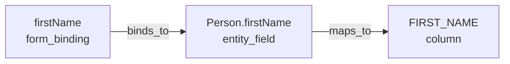

# /wicked-garden:search:lineage

Trace data lineage paths through the symbol graph. Follow data flow from UI fields to database columns (downstream) or reverse (upstream).

## Arguments

- `symbol` (required): The symbol ID to trace from
- `--direction` (optional): Direction to trace (default: downstream)
  - `downstream`: Source → sink (e.g., UI field → DB column)
  - `upstream`: Sink → source (e.g., DB column → UI fields)
  - `both`: Trace in both directions
- `--depth` (optional): Maximum traversal depth (default: 10)
- `--format` (optional): Output format - table, json, mermaid (default: table)
- `--save` (optional): Save computed paths to database

## Instructions

1. Run the lineage tracer (see `skills/unified-search/references/script-runner.md` for runner details):
   ```bash
   cd ${CLAUDE_PLUGIN_ROOT}/scripts && uv run python lineage_tracer.py "<symbol_id>" --db /path/to/graph.db --direction downstream --depth 10 --format table
   ```

3. Report the lineage paths found:
   - Show each path with steps from source to sink
   - Include confidence level and completeness status
   - Note any gaps in the lineage chain

## Examples

```bash
# Trace downstream from a UI field
/wicked-garden:search:lineage form_binding::person.firstName --direction downstream

# Find all UI fields that use a database column
/wicked-garden:search:lineage column::USERS.EMAIL --direction upstream

# Generate Mermaid diagram of data flow
/wicked-garden:search:lineage entity_field::User.email --format mermaid
```

## Output

### Table Format (default)
```
| # | Source | Sink | Steps | Confidence | Complete |
|---|--------|------|-------|------------|----------|
| 1 | firstName | FIRST_NAME | 3 | high | ✓ |
| 2 | lastName | LAST_NAME | 3 | medium | ✓ |
```

### Mermaid Format


## Use Cases

- **Impact analysis**: Before changing a database column, find all UI fields that use it
- **Data flow documentation**: Generate diagrams showing how data flows through the system
- **Debugging**: Trace why a UI field isn't displaying expected data
- **Compliance**: Document which UI fields expose sensitive database columns

## Notes

- Requires indexing first with `/wicked-garden:search:index`
- Use `--save` to persist paths for faster future queries
- Deeper depth = more complete but slower analysis
