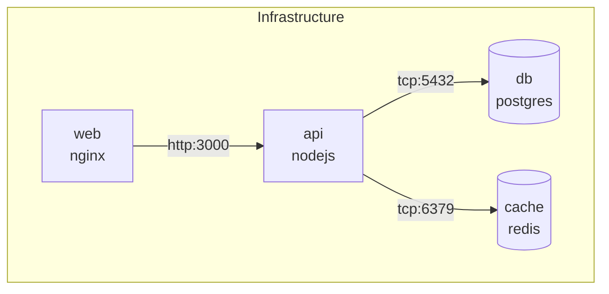

# /wicked-garden:search:service-map

Detect services and their connections from infrastructure configuration files (docker-compose, Kubernetes manifests) or code patterns. Generates a service dependency map.

## Arguments

- `project_root` (optional): Project root directory to scan (default: current directory)
- `--db` (optional): Path to symbol graph database for code pattern detection
- `--format` (optional): Output format - table, json, mermaid (default: table)
- `--save` (optional): Path to save detected services to a database

## Instructions

1. Run the service detector (see `skills/unified-search/references/script-runner.md` for runner details):
   ```bash
   cd ${CLAUDE_PLUGIN_ROOT}/scripts && uv run python service_detector.py /path/to/project --db /path/to/graph.db --format table
   ```

3. Report the service map:
   - **Services**: Name, type, technology
   - **Connections**: Service-to-service dependencies
   - Show source of detection (docker-compose, k8s, or inferred from code)

## Examples

```bash
# Detect services from current project
/wicked-garden:search:service-map

# Detect from a specific project directory
/wicked-garden:search:service-map /path/to/project

# Generate Mermaid architecture diagram
/wicked-garden:search:service-map --format mermaid

# Save detected services to database
/wicked-garden:search:service-map --save /path/to/output.db
```

## Output

### Table Format (default)
```
## Service Map

### Services Detected: 5

| Service | Type | Technology | Source |
|---------|------|------------|--------|
| api | application | nodejs | docker-compose |
| web | application | nginx | docker-compose |
| db | database | postgres | docker-compose |
| cache | cache | redis | docker-compose |
| UserService | service_class | java | code_pattern |

### Connections: 4

| From | To | Type | Protocol | Confidence |
|------|-----|------|----------|------------|
| api | db | database | tcp:5432 | high |
| api | cache | cache | tcp:6379 | high |
| web | api | http | tcp:3000 | high |
| UserService | db | database | jdbc | medium |
```

### Mermaid Format


## Detection Sources (Priority Order)

1. **Docker Compose** (highest confidence)
   - Parses `docker-compose.yml`, `docker-compose.*.yml`
   - Extracts services, networks, and depends_on relationships
   - Detects database types from image names

2. **Kubernetes** (high confidence)
   - Parses Deployment, Service, ConfigMap manifests
   - Extracts service names and selectors
   - Detects inter-service connections from environment variables

3. **Code Patterns** (fallback, medium/low confidence)
   - Detects `@Service`, `@RestController` annotations
   - Finds connection strings in configuration
   - Infers HTTP clients calling other services

## Use Cases

- **Onboarding**: Understand service architecture quickly
- **Documentation**: Generate up-to-date architecture diagrams
- **Impact analysis**: Know which services depend on a changing service
- **Migration planning**: Map current state before refactoring

## Notes

- Run `/wicked-garden:search:index` first for code pattern detection
- Infrastructure sources (docker, k8s) don't require indexing
- Use `--save` to persist for cross-referencing with lineage data
- Code patterns are used as a fallback when no infrastructure files are found
