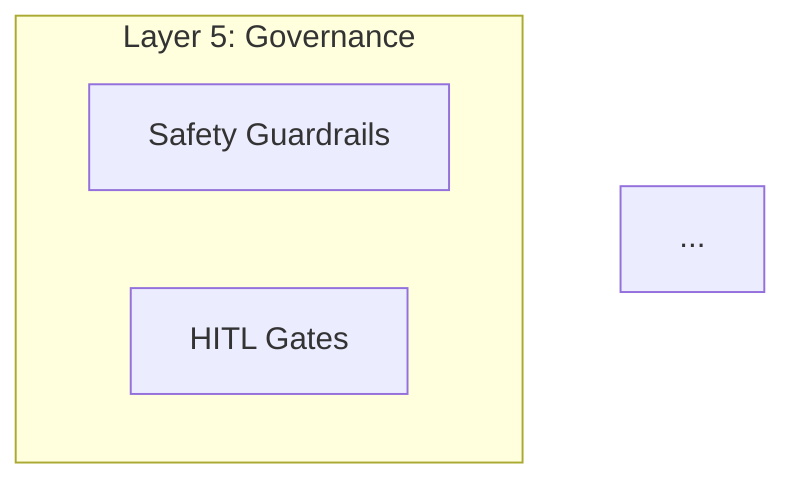

# Five-Layer Architecture Design

This scenario validates that wicked-agentic's design command conducts an interactive requirements gathering session, produces a five-layer architecture design with Mermaid diagram, and includes safety validation from the safety reviewer agent.

## Setup

No project files needed. The design command creates a new architecture from scratch.

## Steps

### 1. Interactive Design Session (No Problem Statement)

```bash
/wicked-agentic:design
```

**Expected**:
- `wicked-agentic:architect` agent spawned in design mode
- Asks 3-5 focused clarifying questions
- Questions cover: problem space, functional requirements, non-functional requirements, constraints

**Expected questions**:
```
I'll help you design an agentic system. Let me ask a few questions:

1. What problem are you solving with agents?
2. Who are the users and what tasks must the system perform?
3. What's your target latency and scale?
4. Do you have existing technology stack constraints?
5. Any compliance requirements (GDPR, HIPAA, etc.)?
```

**User responds**: "I need a code review assistant that can analyze PRs, check security vulnerabilities, run static analysis, and generate review comments. Used by developers. Need < 30s response. Python + GitHub integration."

### 2. Verify Five-Layer Architecture Output

After gathering requirements, the architect should produce a design with all five layers:

```
## Five-Layer Design

### Layer 1: Cognition
- Reasoning engine for code analysis
- Task planner for breaking down PR review workflow

### Layer 2: Context
- Working memory: current PR diff and comments
- Long-term store: codebase patterns and previous reviews

### Layer 3: Interaction
- GitHub API tool (PR access, comment creation)
- Static analysis tool (ast, pylint)
- SAST scanner (bandit for Python)

### Layer 4: Runtime
- PR Review Orchestrator
- Latency monitoring (< 30s SLA)

### Layer 5: Governance
- HITL gate for critical security findings
- Cost controls (token budget per review)
```

**Expected Mermaid diagram** in output:


### 3. Verify Safety Validation Integration

After architecture design, the command should spawn the safety reviewer:

```
Task: wicked-agentic:safety-reviewer

Context:
- Proposed architecture: PR review assistant
- Tools planned: GitHub API, static analysis, SAST scanner

[Safety reviewer analyzes and returns]
```

**Expected safety output**:
```markdown
## Safety Considerations

### Tool Risk Assessment
| Tool | Risk Level | Required Mitigations |
|------|------------|---------------------|
| GitHub API (comment creation) | HIGH | Rate limiting, content validation |
| SAST scanner | MEDIUM | Sandboxed execution |
| Static analysis | LOW | None required |

### Required Safeguards
1. Human-in-the-loop: Required for posting critical security findings
2. Input validation: Validate PR file list before analysis
3. Rate limiting: Max 100 API calls per review
```

### 4. Problem Statement Shortcut

```bash
/wicked-agentic:design "Build a customer support bot that answers FAQs, creates Zendesk tickets, and escalates to humans when confidence is low"
```

**Expected**:
- Fewer clarifying questions (2-3 instead of 5) since context is provided
- Faster path to architecture output
- Design still includes all five layers
- Safety validation still runs

### 5. Save Design to File

```bash
/wicked-agentic:design "Research assistant for academic papers" --output ~/test-wicked-agentic/design.md
```

**Expected**:
- Interactive session runs as normal
- Final design document written to file
- Confirmation: "Design document written to ~/test-wicked-agentic/design.md"
- Summary shown inline

## Expected Outcome

Full design document includes:

```markdown
# Agentic Architecture Design

**Problem**: Code review assistant for PRs
**Pattern**: Hierarchical Orchestration
**Framework**: LangGraph
**Generated**: [timestamp]

## Architecture

### Pattern: Hierarchical Orchestration

Coordinator agent manages specialized sub-agents for different review aspects.

### Five-Layer Design

[Mermaid diagram with all 5 layers]

### Agent Breakdown
| Agent | Responsibility | Tools | Inputs | Outputs |
|-------|---------------|-------|--------|---------|
| Coordinator | Orchestrate PR review | None | PR URL | Review summary |
| Security Agent | Find vulnerabilities | SAST scanner | Code files | Security findings |
| Quality Agent | Check patterns/style | pylint | Code files | Quality findings |
| Comment Agent | Post GitHub comments | GitHub API | Findings | Posted comments |

## Safety & Security

### Required Safeguards
1. HITL: Required before posting critical security findings
2. Rate limiting: Max 100 GitHub API calls per review
3. Content validation: Sanitize comment content before posting

## Implementation Roadmap

### Phase 1: Foundation (Week 1)
1. Set up LangGraph framework
2. Implement Coordinator agent
3. Build GitHub API tool

[Phases 2-3...]
```

## Success Criteria

- [ ] Architect agent spawned via Task tool (not inline)
- [ ] Safety reviewer agent spawned via Task tool after design
- [ ] All five layers present in architecture design
- [ ] Mermaid diagram included and syntactically valid
- [ ] Agent breakdown table shows each agent with responsibilities
- [ ] Framework recommendation included with rationale
- [ ] Safety considerations section covers tool risk assessment
- [ ] Implementation roadmap has at least 3 phases
- [ ] Problem statement shortcut reduces clarifying questions
- [ ] `--output` flag writes design to file

## Value Demonstrated

**Problem solved**: Designing agentic systems correctly requires expertise in patterns, safety, and layer separation that most developers don't have. Systems built without this foundation are hard to test, unsafe, and expensive to operate.

**Real-world value**:
- **Safety-by-design**: Safety validation is integrated into the design process, not an afterthought
- **Pattern guidance**: Recommends the right agentic pattern (sequential vs hierarchical vs parallel) for the use case
- **Complete architecture**: Five-layer design ensures nothing is forgotten — including governance
- **Executable roadmap**: Phased implementation plan breaks down what to build first

This replaces informal architecture decisions made by developers who read one blog post about LangChain and started coding. The five-layer framework ensures cognitive separation (reasoning), context management (memory), interaction safety (tool guardrails), runtime observability, and governance — all captured before a line of code is written.
