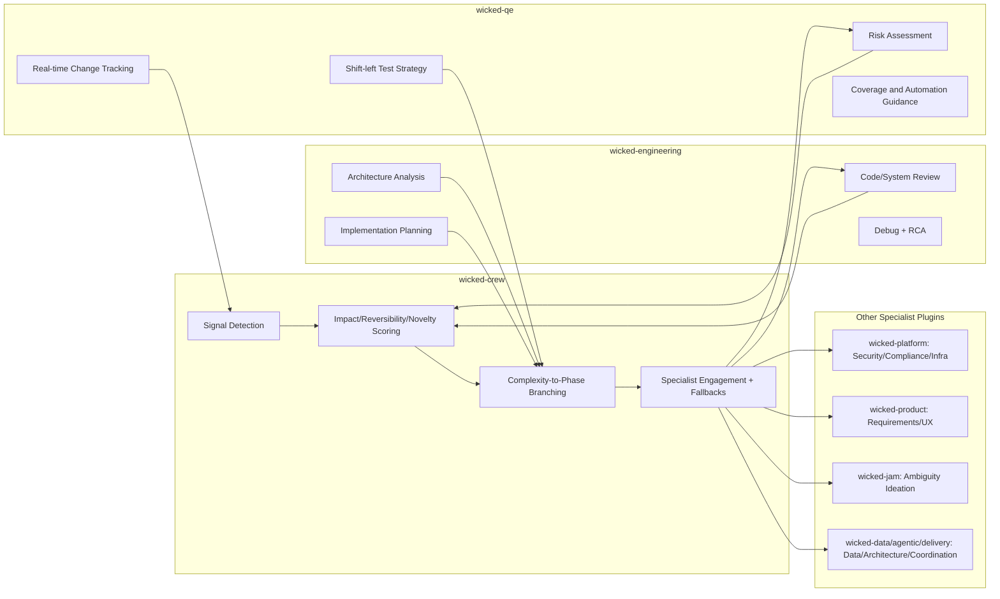

# Dynamic Signal Routing Architecture (Logical Diagram)

Generated: 2026-02-23 21:12:45Z (UTC)

This diagram models how business and engineering signals from `wicked-crew`, `wicked-qe`, and specialist plugins converge into a shared scoring, impact, and branching process.

## 1) End-to-End Signal Convergence and Branching

```mermaid
flowchart TD
    A[Input Sources\n- Business goals\n- Engineering change intent\n- Code/file paths\n- Session change events] --> B[Signal Ingestion Layer\nwicked-crew Smart Decisioning\nwicked-qe Change Tracker]

    B --> C[Signal Normalization\nCategories:\nsecurity/performance/product/compliance/ambiguity/complexity/data/infrastructure/architecture/ux/reversibility/novelty]

    C --> D[Convergence Hub\nUnified Signal Graph\nBusiness + Engineering + QE Evidence]

    D --> E[Scoring Engine]
    E --> E1[Impact 0-3\nFile-role taxonomy + integration keywords]
    E --> E2[Reversibility 0-3\nIrreversibility vs mitigators]
    E --> E3[Novelty 0-3\nUnfamiliarity + ambiguity indicators]
    E1 --> F[Complexity Composition 0-7\nimpact + min(max(reversibility, novelty),2) + scope + coordination]
    E2 --> F
    E3 --> F

    D --> G[Archetype Adjuster\nInfrastructure/compliance/ui/api/data/etc.\nApplies impact bonus + minimum complexity floor]
    G --> F

    F --> H{Branching Decision}
    H -->|0-2| I[Fast Track\nclarify -> build -> review]
    H -->|3-4| J[Expanded Track\n+ design + test-strategy]
    H -->|5-7| K[Full Adaptive Track\n+ ideate + test + full gates]

    C --> L[Specialist Router]
    L --> L1[wicked-engineering\narchitecture/review/debug]
    L --> L2[wicked-qe\nrisk/scenarios/automation]
    L --> L3[wicked-platform\nsecurity/compliance/infra]
    L --> L4[wicked-product / wicked-jam / wicked-data / wicked-agentic / wicked-delivery]

    I --> M[Execution Orchestration\nPhase-by-phase delivery]
    J --> M
    K --> M
    L1 --> M
    L2 --> M
    L3 --> M
    L4 --> M

    M --> N[Quality + Impact Gates\n- QE coverage & risk review\n- Engineering review\n- Evidence and approval checks]
    N --> O{Outcome}
    O -->|Pass| P[Advance / Complete]
    O -->|Risk Found| Q[Feedback Loop\nInject new signals\nRe-score and re-branch]
    Q --> D
```

## 2) Plugin Responsibility View (Logical)



## 3) Branching Semantics (What Convergence Controls)

- **Convergence point**: all discovered signals become a shared decision input, not isolated plugin outputs.
- **Scoring point**: risk and delivery complexity become explicit numeric controls.
- **Branching point**: phase depth and specialist breadth are selected from the scored complexity band.
- **Feedback point**: QE and engineering findings emit new signals, forcing re-convergence and adaptive re-branching.

