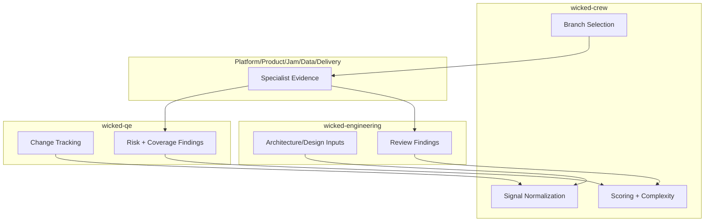
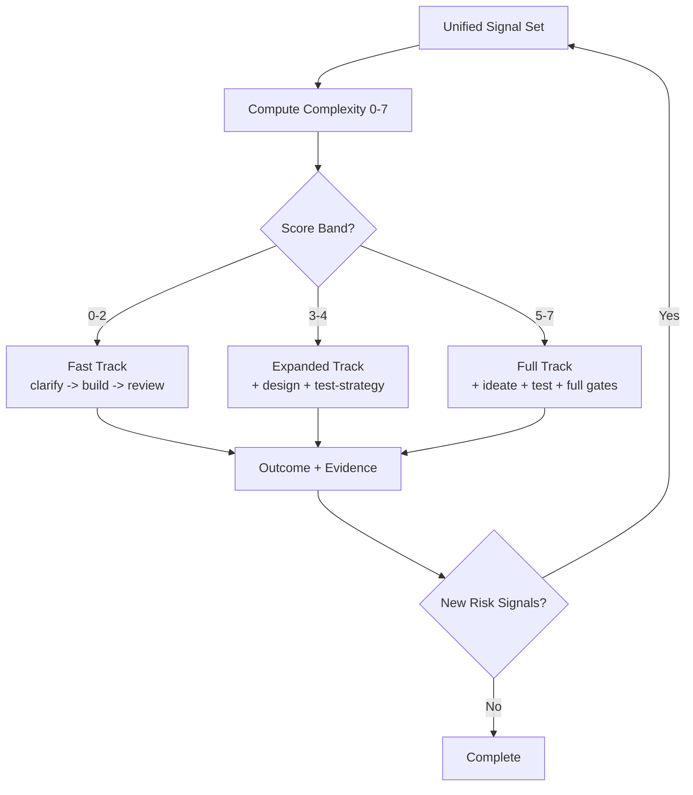

# Dynamic Signal Routing: 4 Architecture Versions (Comparison + Best Pick)

Generated: 2026-02-23 UTC

## Goal
Compare four logical architecture versions for how **business + engineering signals** converge into **scoring, impact processing, and branching**, then select the strongest overview.

---

## Version 1 — Linear Pipeline (Simple Narrative)


**Pros**
- Easiest to read quickly.
- Good for executive one-slide storytelling.

**Cons**
- Weak plugin-level accountability.
- Feedback loops and adaptive re-branching are underrepresented.

---

## Version 2 — Plugin Swimlanes (Responsibility Clarity)



**Pros**
- Strong ownership model per plugin.
- Good for implementation teams.

**Cons**
- Less explicit on branching thresholds and gate semantics.
- Harder for non-technical stakeholders.

---

## Version 3 — Decision Tree First (Branching Emphasis)



**Pros**
- Best view of branch behavior.
- Very strong for governance discussions.

**Cons**
- Signal source and role boundaries are abstracted away.
- Scoring dimensions are compressed into one step.

---

## Version 4 — Convergence Hub + Scoring Internals + Adaptive Loop (**Best Overall**)

```mermaid
flowchart TD
    A[Input Sources\nBusiness Objectives + Engineering Intent + File/Change Signals] --> B[Signal Ingestion\ncrew smart decisioning + qe change tracker]
    B --> C[Signal Normalization\nsecurity/performance/product/compliance/ambiguity/complexity/data/infrastructure/architecture/ux/reversibility/novelty]

    C --> D[Convergence Hub\nShared signal graph + accumulated evidence]

    D --> E[Scoring Engine]
    E --> E1[Impact 0-3\nfile-role taxonomy + integration keywords]
    E --> E2[Reversibility 0-3\nirreversibility vs mitigators]
    E --> E3[Novelty 0-3\nunknowns + ambiguity indicators]
    E1 --> F[Complexity 0-7\nimpact + min(round(rev*nov*0.22), 2) + scope + coordination]
    E2 --> F
    E3 --> F

    D --> G[Archetype Adjustment\ninfrastructure/compliance/ui/api/data floors & bonuses]
    G --> F

    F --> H{Branching}
    H -->|0-2| I[Fast Track]
    H -->|3-4| J[Expanded Track]
    H -->|5-7| K[Full Adaptive Track]

    C --> L[Specialist Router]
    L --> L1[wicked-engineering]
    L --> L2[wicked-qe]
    L --> L3[wicked-platform]
    L --> L4[wicked-product / wicked-jam / wicked-data / wicked-agentic / wicked-delivery]

    I --> M[Execution + Gates]
    J --> M
    K --> M
    L1 --> M
    L2 --> M
    L3 --> M
    L4 --> M

    M --> N{Pass Gates?}
    N -->|Yes| O[Advance / Complete]
    N -->|No| P[Emit Findings as New Signals]
    P --> D
```

**Pros**
- Most complete representation of convergence, scoring internals, branching, routing, and feedback.
- Balances executive and engineering readability.
- Preserves the systemic "adaptive control loop" that matters for dynamic routing.

**Cons**
- Denser than V1/V3.

---

## Comparison Matrix

| Criterion | V1 | V2 | V3 | V4 |
|---|---:|---:|---:|---:|
| Executive readability | 5 | 3 | 4 | 4 |
| Plugin responsibility clarity | 2 | 5 | 2 | 4 |
| Scoring transparency | 2 | 3 | 3 | 5 |
| Branching clarity | 3 | 2 | 5 | 5 |
| Feedback/adaptation clarity | 1 | 3 | 4 | 5 |
| **Overall** | **13** | **16** | **18** | **23** |

## Recommendation
Use **Version 4** as the canonical architecture diagram.
- It is the best single overview for design, implementation, and governance.
- It explicitly shows the convergence of business + engineering signals into a numeric scoring-and-branching control process.
- It preserves the adaptive feedback mechanism required by dynamic routing.
