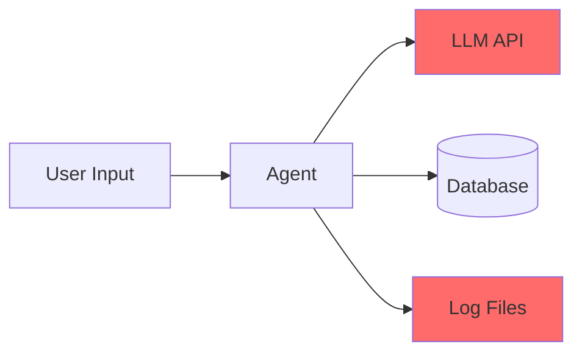

# /wicked-garden:agentic-audit

Comprehensive safety and security audit for agentic systems. Analyzes tool risks, validates human-in-the-loop gates, checks PII handling, and generates a compliance-ready safety report.

## Instructions

### 1. Parse Arguments

Extract parameters:
- `path`: Target directory to audit (default: current directory)
- `--output FILE`: Write audit report to file
- `--standard STANDARD`: Check compliance against specific standard (GDPR, HIPAA, SOC2, NIST)

### 2. Detect Framework

Identify framework to understand security model:
```bash
python3 "${CLAUDE_PLUGIN_ROOT}/scripts/detect_framework.py" --path "$TARGET_PATH"
```

Framework detection informs:
- How tools are registered and called
- Where to look for access controls
- Framework-specific security features
- Default safety mechanisms

### 3. Analyze Agent Topology

Map agent structure for trust boundaries:
```bash
python3 "${CLAUDE_PLUGIN_ROOT}/scripts/analyze_agents.py" --path "$TARGET_PATH" \
  --framework "$DETECTED_FRAMEWORK"
```

Expected output includes agent details and communication graph:
```json
{
  "agents": [
    {
      "name": "research_agent",
      "type": "primary",
      "file": "agents/research.py",
      "tools": ["web_search"],
      "role": "Information gathering"
    },
    {
      "name": "coding_agent",
      "type": "primary",
      "file": "agents/coder.py",
      "tools": ["execute_code"],
      "role": "Code generation and execution"
    }
  ],
  "communication": {
    "supervisor": "orchestrator",
    "graph": []
  },
  "shared_tools": []
}
```

### 4. Spawn Safety Reviewer in Deep Audit Mode

Launch comprehensive safety analysis:

```
Task(
  subagent_type="wicked-garden:agentic/safety-reviewer",
  prompt="Mode: deep_audit\n\nContext:\n- Framework: {detected_framework}\n- Topology: {agent_topology}\n- Tools: {tool_inventory}\n- Compliance standard: {standard if specified}\n\nInstructions:\nLoad skill wicked-garden:agentic-trust-and-safety\n\nPerform comprehensive safety audit:\n\n1. Tool Risk Classification - assess risk level, attack surface, abuse potential, data exposure, required mitigations\n2. Human-in-the-Loop Gates - verify approval requirements, validation, bypass prevention, audit trail\n3. PII and Sensitive Data - check detection/redaction, minimization, encryption, retention, access controls\n4. Input Validation - analyze prompt injection, SQL injection, command injection, SSRF, input sanitization\n5. Authentication & Authorization - verify tool access controls, permission model, credential/secrets management\n6. Rate Limiting & Quotas - check API rate limits, cost controls, throttling, abuse prevention\n7. Monitoring & Observability - assess audit logging, sensitive data in logs, alerting, incident readiness\n8. Failure Modes - analyze graceful degradation, error info leakage, retry safety, circuit breakers\n\nOutput comprehensive safety report."
)
```

### 5. Classify Tool Risks

For each tool, apply risk matrix:

```
Risk Classification Framework:

CRITICAL:
- Arbitrary code execution
- Database writes without validation
- File system writes outside sandbox
- Shell command execution
- Payment processing
- Account deletion

HIGH:
- External API calls with user-controlled params
- File uploads
- Email sending
- Database reads of sensitive data
- User impersonation

MEDIUM:
- Web search
- Public API reads
- File reads within project
- Non-sensitive database queries

LOW:
- Math calculations
- String manipulation
- Static data lookup
- Formatting utilities
```

Generate risk matrix:
```json
{
  "critical_risk": [
    {
      "tool": "execute_python",
      "risk": "CRITICAL",
      "reason": "Arbitrary code execution",
      "mitigations_required": [
        "Sandboxed execution environment",
        "Human approval for all executions",
        "Code review and static analysis",
        "Timeout and resource limits"
      ],
      "current_mitigations": [],
      "status": "UNPROTECTED"
    }
  ],
  "high_risk": [...],
  "medium_risk": [...],
  "low_risk": [...]
}
```

### 6. Verify Human-in-the-Loop

Check for required approval mechanisms:

```python
# Pattern detection for HITL gates
patterns = [
    "approve", "confirm", "verify",
    "human_input", "await_approval",
    "require_confirmation"
]

# Analyze code for HITL implementation
for tool in critical_and_high_risk_tools:
    has_hitl = check_for_approval_gate(tool)
    if not has_hitl:
        flag_as_violation(tool)
```

Expected HITL patterns:
```python
# GOOD: Explicit approval gate
def execute_code(code: str):
    if not await_human_approval(code):
        raise SecurityError("Execution denied")
    return run_in_sandbox(code)

# BAD: No approval gate
def execute_code(code: str):
    return subprocess.run(code, shell=True)  # CRITICAL RISK
```

### 7. PII Detection Analysis

Scan for PII handling:

```bash
# Check for PII detection libraries
grep -r "presidio\|pii_detect\|redact\|anonymize" "$TARGET_PATH"

# Check for sensitive data patterns
grep -r "ssn\|social_security\|credit_card\|email\|phone" "$TARGET_PATH"

# Check logging for PII
grep -r "logger\|logging\|log\." "$TARGET_PATH"
```

Validate PII controls:
- [ ] PII detection before LLM
- [ ] Redaction before logging
- [ ] Encryption for stored PII
- [ ] Access controls on PII
- [ ] Retention policy

### 8. Check Compliance Requirements

If `--standard` specified, validate against requirements:

#### GDPR Compliance
- [ ] Data minimization
- [ ] Right to erasure (delete user data)
- [ ] Data portability
- [ ] Consent management
- [ ] PII encryption
- [ ] Breach notification capability

#### HIPAA Compliance
- [ ] PHI encryption at rest
- [ ] PHI encryption in transit
- [ ] Access controls and audit logs
- [ ] Business associate agreements
- [ ] Breach notification process
- [ ] Minimum necessary standard

#### SOC2 Compliance
- [ ] Access controls
- [ ] Encryption
- [ ] Logging and monitoring
- [ ] Incident response plan
- [ ] Change management
- [ ] Vendor management

### 9. Generate Safety Audit Report

Combine all findings into structured report:

```markdown
# Trust & Safety Audit Report

**Project**: {project_name}
**Framework**: {detected_framework}
**Audited**: {timestamp}
**Compliance Standard**: {standard if specified}
**Overall Risk**: {CRITICAL/HIGH/MEDIUM/LOW}

## Executive Summary

{2-3 paragraph overview of security posture}

Key findings:
- **Critical issues**: {count}
- **High-risk tools**: {count}
- **Missing HITL gates**: {count}
- **PII handling gaps**: {count}
- **Compliance gaps**: {count}

**Recommendation**: {READY FOR PRODUCTION / REQUIRES REMEDIATION / MAJOR SECURITY GAPS}

## Risk Matrix

### Critical Risk Tools ({count})

| Tool | Risk | Current Mitigations | Required Mitigations | Status |
|------|------|---------------------|---------------------|--------|
| {tool} | CRITICAL | {current} | {required} | {PROTECTED/UNPROTECTED} |

**Critical findings**:
1. {finding with location and fix}

### High Risk Tools ({count})

| Tool | Risk | Current Mitigations | Required Mitigations | Status |
|------|------|---------------------|---------------------|--------|
| {tool} | HIGH | {current} | {required} | {status} |

### Medium & Low Risk

{summary of medium and low risk tools}

## Human-in-the-Loop Assessment

### Required HITL Gates

| Operation | Risk Level | HITL Gate Present | Implementation |
|-----------|-----------|-------------------|----------------|
| {operation} | {level} | {YES/NO} | {description or MISSING} |

### HITL Violations

1. **{Tool name}** - {file:line}
   - **Risk**: {risk_description}
   - **Current**: No approval gate
   - **Required**: Human confirmation before execution
   - **Fix**:
   ```python
   {code example showing proper HITL}
   ```

### HITL Best Practices

✅ **Implemented**:
- {practice}

❌ **Missing**:
- {practice}

## PII & Sensitive Data Handling

### PII Detection

| Location | PII Type | Protected | Remediation |
|----------|----------|-----------|-------------|
| {file:line} | {type} | {YES/NO} | {fix} |

### Data Flow Analysis



**PII Exposure Points**:
1. **LLM API calls** - {status and fix}
2. **Logs** - {status and fix}
3. **Database** - {status and fix}

### PII Control Checklist

- [ ] PII detection before LLM (e.g., Presidio)
- [ ] Redaction in logs
- [ ] Encryption at rest
- [ ] Encryption in transit
- [ ] Access controls
- [ ] Retention policy
- [ ] Right to erasure

**Gaps**:
1. {gap with remediation}

## Input Validation & Injection Prevention

### Prompt Injection

**Vulnerable locations**:
1. {file:line} - {vulnerability description}
   ```python
   # VULNERABLE
   {code}

   # FIX
   {secure_code}
   ```

### SQL Injection

{assessment if database tools present}

### Command Injection

{assessment if shell tools present}

### SSRF Prevention

{assessment if web tools present}

## Authentication & Authorization

### Access Controls

| Component | Auth Required | Implementation | Status |
|-----------|--------------|----------------|--------|
| {component} | {YES/NO} | {impl} | {status} |

### Secrets Management

**Found credentials**:
- {location}: {type}

**Recommendations**:
1. Move to environment variables
2. Use secret manager (AWS Secrets Manager, Vault)
3. Rotate credentials regularly

### Authorization Model

{description of who can access what}

**Gaps**:
- {gap}

## Rate Limiting & Cost Controls

### API Rate Limits

| Service | Current Limit | Recommended | Implemented |
|---------|--------------|-------------|-------------|
| {service} | {current} | {recommended} | {YES/NO} |

### Cost Controls

- Daily spend limit: {implemented or MISSING}
- Per-request budget: {implemented or MISSING}
- Quota monitoring: {implemented or MISSING}

**Recommendations**:
1. {recommendation}

## Monitoring & Observability

### Audit Logging

**Events logged**:
- [ ] Tool execution
- [ ] Agent decisions
- [ ] Errors and failures
- [ ] Human approvals/denials
- [ ] Access control violations

**Gaps**:
- {missing logging}

### Sensitive Data in Logs

**Found**:
- {file:line}: {sensitive_data_type}

**Fix**: Redact before logging

### Alerting

**Configured alerts**:
- {alert_description}

**Missing alerts**:
- {recommended_alert}

## Compliance Assessment

{If --standard specified, detailed compliance checklist}

### {GDPR/HIPAA/SOC2} Compliance

| Requirement | Status | Evidence | Gap |
|------------|--------|----------|-----|
| {requirement} | {PASS/FAIL} | {evidence} | {gap} |

**Compliance Score**: {X}/{total} ({percentage}%)

**Critical gaps**:
1. {gap with remediation}

## Failure Modes & Resilience

### Error Handling

**Graceful degradation**: {assessment}

**Information leakage**: {assessment}

**Examples**:
```python
# BAD: Leaks internal details
except Exception as e:
    return f"Database error: {e}"  # Exposes DB structure

# GOOD: Safe error message
except Exception as e:
    log_error(e)  # Log internally
    return "An error occurred. Please try again."
```

### Circuit Breakers

| Service | Circuit Breaker | Threshold | Fallback |
|---------|----------------|-----------|----------|
| {service} | {YES/NO} | {threshold} | {fallback} |

## Remediation Roadmap

### Phase 1: Critical Fixes (URGENT - 1-2 days)

1. **{Issue}** - {file:line}
   - **Risk**: CRITICAL
   - **Impact**: {impact}
   - **Fix**: {detailed remediation}
   - **Effort**: {hours/days}

### Phase 2: High-Risk Mitigations (1 week)

1. **{Issue}**
   - **Risk**: HIGH
   - **Impact**: {impact}
   - **Fix**: {remediation}
   - **Effort**: {hours/days}

### Phase 3: PII & Compliance (2 weeks)

1. **{Issue}**
   - **Impact**: {impact}
   - **Fix**: {remediation}
   - **Effort**: {hours/days}

### Phase 4: Monitoring & Hardening (3-4 weeks)

1. **{Issue}**
   - **Impact**: {impact}
   - **Fix**: {remediation}
   - **Effort**: {hours/days}

**Total estimated effort**: {total_effort}

## Security Scorecard

| Category | Score | Status |
|----------|-------|--------|
| Tool Risk Management | {score}/10 | {status} |
| Human-in-the-Loop | {score}/10 | {status} |
| PII Handling | {score}/10 | {status} |
| Input Validation | {score}/10 | {status} |
| Auth & Access Control | {score}/10 | {status} |
| Rate Limiting | {score}/10 | {status} |
| Monitoring | {score}/10 | {status} |
| Compliance | {score}/10 | {status} |

**Overall Security Score**: {total_score}/10

## Recommendations

### Immediate Actions
1. {action}

### Short-term Improvements (1-2 weeks)
1. {improvement}

### Long-term Hardening (1-3 months)
1. {enhancement}

## Appendix: Tool Inventory

{Full list of all tools with classifications}

## Appendix: Code References

{Links to specific code locations for all findings}
```

### 10. Optional: Generate Wicked-Scenarios Format

When `--scenarios` is passed, generate wicked-scenarios format test scenarios that verify the safety controls identified in the audit.

**Audit finding → scenario mapping:**

| Finding Type | Scenario Category | Tools | What to Test |
|-------------|-------------------|-------|-------------|
| Missing HITL gates | api | curl | Approval gate enforcement, bypass prevention |
| PII exposure (static) | security | semgrep | PII pattern detection in code |
| PII exposure (dynamic) | api | curl | PII redaction in API responses |
| Injection vulnerabilities | security | semgrep | Prompt injection, command injection defenses |
| Missing rate limits | perf | k6, hey | Rate limit enforcement under load |
| Auth/access control gaps | api | curl | Permission enforcement, credential handling |
| Compliance gaps | security | semgrep | Regulatory requirement verification |

For each CRITICAL/HIGH audit finding, produce a wicked-scenarios block:

````markdown
---
name: {project-kebab}-safety
description: "Trust & safety scenarios from audit of {project}"
category: security
tools:
  required: [semgrep]
difficulty: advanced
timeout: 120
---

## Steps

### Step 1: PII pattern detection in code (semgrep)

```bash
# Scan for unredacted PII handling
semgrep --config p/secrets --config p/pii --json .
```

**Expect**: Exit code 0 — no unredacted PII patterns in codebase

### Step 2: Injection vulnerability scan (semgrep)

```bash
# Scan for command/prompt injection vulnerabilities
semgrep --config p/command-injection --config p/owasp-top-ten --json .
```

**Expect**: Exit code 0 — no injection vulnerabilities found

### Step 3: Missing approval gate detection (semgrep)

```bash
# Scan for critical operations without approval gates
semgrep --config r/python.lang.security.dangerous-exec --json .
```

**Expect**: Exit code 0 — all critical ops have approval checks
````

**Note**: For dynamic HTTP testing of safety controls (HITL gate enforcement, API PII redaction, prompt injection via HTTP), generate a separate `api` category scenario using `curl`.

**Audit finding → CLI test patterns:**
- **HITL violations (static)** → `semgrep` scan for critical ops without approval gates
- **HITL violations (dynamic)** → generate separate `api` category scenario with `curl` for HTTP testing
- **PII exposure (static)** → `semgrep` with PII/secrets rules
- **PII exposure (dynamic)** → generate separate `api` category scenario with `curl` for response testing
- **Prompt injection (static)** → `semgrep` with injection detection rules
- **Rate limits** → generate a separate `perf` category scenario using `k6` or `hey` to verify 429
- **Auth gaps** → `curl` without credentials to protected endpoints, verify 401
- **Compliance** → `semgrep --config` with relevant compliance rules

If `--output` specified, write to file:
```bash
echo "$REPORT" > "$OUTPUT_FILE"
echo "Safety audit report written to $OUTPUT_FILE"
```

## Examples

### Basic Safety Audit

```
User: /wicked-garden:agentic-audit ./src

Claude: I'll perform a comprehensive safety audit of your agentic system.

[Detects framework: LangChain]
[Analyzes agent topology: 4 agents, 7 tools]
[Spawns safety-reviewer in deep audit mode]

# Trust & Safety Audit Report

**Project**: customer-support-bot
**Framework**: LangChain v0.1.0
**Audited**: 2026-02-05 15:45:00 UTC
**Overall Risk**: HIGH

## Executive Summary

Your customer support system has 2 critical and 3 high-risk tools without adequate safeguards. Code execution and email sending tools lack human-in-the-loop gates. PII is passed to LLM without redaction.

Key findings:
- **Critical issues**: 2
- **High-risk tools**: 3
- **Missing HITL gates**: 2
- **PII handling gaps**: 4
- **Compliance gaps**: 5 (GDPR)

**Recommendation**: REQUIRES IMMEDIATE REMEDIATION before production use.

## Risk Matrix

### Critical Risk Tools (2)

| Tool | Risk | Current Mitigations | Required Mitigations | Status |
|------|------|---------------------|---------------------|--------|
| execute_python | CRITICAL | Timeout only | Sandbox + HITL + Review | UNPROTECTED |
| send_email | CRITICAL | None | HITL + Validation + Rate limit | UNPROTECTED |

**Critical findings**:

1. **execute_python - src/tools/code_executor.py:23**
   - **Risk**: Arbitrary code execution without sandbox
   - **Current**: Basic 30s timeout
   - **Required**: Sandboxed environment, human approval, code review
   - **Fix**:
   ```python
   def execute_python(code: str):
       # Add human approval
       if not await_human_approval(code, risk_level="CRITICAL"):
           raise SecurityError("Code execution denied")

       # Run in sandbox
       return docker_sandbox.run(
           code,
           timeout=30,
           network="none",  # Disable network
           read_only_fs=True
       )
   ```

2. **send_email - src/tools/email.py:45**
   - **Risk**: Email sending without validation or approval
   - **Current**: No mitigations
   - **Required**: Recipient validation, human approval, rate limits
   - **Fix**:
   ```python
   def send_email(to: str, subject: str, body: str):
       # Validate recipient
       if not is_approved_domain(to):
           raise SecurityError(f"Unapproved recipient: {to}")

       # Human approval for external recipients
       if not is_internal(to):
           if not await_human_approval(
               f"Send email to {to}?\nSubject: {subject}\n\n{body[:200]}..."
           ):
               raise SecurityError("Email sending denied")

       # Rate limit
       if not rate_limiter.allow(key=to, limit=10, window="1h"):
           raise SecurityError("Rate limit exceeded")

       return smtp_send(to, subject, body)
   ```

[Full report continues with all sections...]

## Remediation Roadmap

### Phase 1: Critical Fixes (URGENT - 1-2 days)

1. **Add sandbox to code execution** - 4 hours
   - Implement Docker-based sandbox
   - Disable network access
   - Set resource limits

2. **Add HITL to critical tools** - 4 hours
   - Implement approval gateway
   - Add confirmation UI
   - Log approvals/denials

**Total Phase 1**: 8 hours (1 day)

[Phases 2-4...]

**Total estimated effort**: 40 hours (1 week)

## Security Scorecard

| Category | Score | Status |
|----------|-------|--------|
| Tool Risk Management | 3/10 | ❌ CRITICAL |
| Human-in-the-Loop | 2/10 | ❌ CRITICAL |
| PII Handling | 4/10 | ⚠️ NEEDS WORK |
| Input Validation | 6/10 | ⚠️ NEEDS WORK |
| Auth & Access Control | 7/10 | ✅ GOOD |
| Rate Limiting | 3/10 | ❌ CRITICAL |
| Monitoring | 5/10 | ⚠️ NEEDS WORK |
| Compliance | 4/10 | ⚠️ NEEDS WORK |

**Overall Security Score**: 4.25/10 - HIGH RISK
```

### GDPR Compliance Audit

```
User: /wicked-garden:agentic-audit . --standard GDPR

Claude: I'll audit your system for GDPR compliance.

[Performs safety audit with GDPR focus]

# Trust & Safety Audit Report - GDPR Compliance

[Standard sections...]

## GDPR Compliance Assessment

### GDPR Requirements

| Requirement | Status | Evidence | Gap |
|------------|--------|----------|-----|
| Data minimization | ❌ FAIL | Collects full conversation history | Implement retention limits |
| Right to erasure | ❌ FAIL | No delete functionality | Add user data deletion API |
| Data portability | ❌ FAIL | No export functionality | Add data export API |
| Consent management | ⚠️ PARTIAL | Opt-in at signup | Need explicit consent for data uses |
| PII encryption | ❌ FAIL | PII stored in plaintext logs | Encrypt or redact PII |
| Breach notification | ✅ PASS | Incident response plan exists | - |

**Compliance Score**: 2/6 (33%) - NON-COMPLIANT

**Critical gaps**:

1. **Right to erasure** - No implementation
   - **GDPR Article 17**: Users can request deletion
   - **Fix**: Implement delete_user_data() endpoint
   ```python
   def delete_user_data(user_id: str):
       # Delete from all systems
       conversation_db.delete(user_id=user_id)
       analytics_db.delete(user_id=user_id)
       logs.redact(user_id=user_id)
       # Log deletion for audit
       audit_log.record("user_data_deleted", user_id=user_id)
   ```

2. **PII in logs** - Multiple violations
   - **GDPR Article 5**: Data minimization
   - **Found**: Email, names in logs at src/logger.py:34
   - **Fix**: Redact before logging

[Full GDPR assessment...]
```

### Save Audit to File

```
User: /wicked-garden:agentic-audit ./agents --output reports/safety-audit.md

Claude: [Performs comprehensive safety audit]

Safety audit report written to reports/safety-audit.md

Summary:
- Overall risk: HIGH
- Critical issues: 2 (code execution, email sending)
- High-risk issues: 3
- PII handling gaps: 4
- Estimated remediation: 1 week

Priority actions:
1. Add sandbox to code execution tool
2. Add human approval gates
3. Implement PII redaction
```
