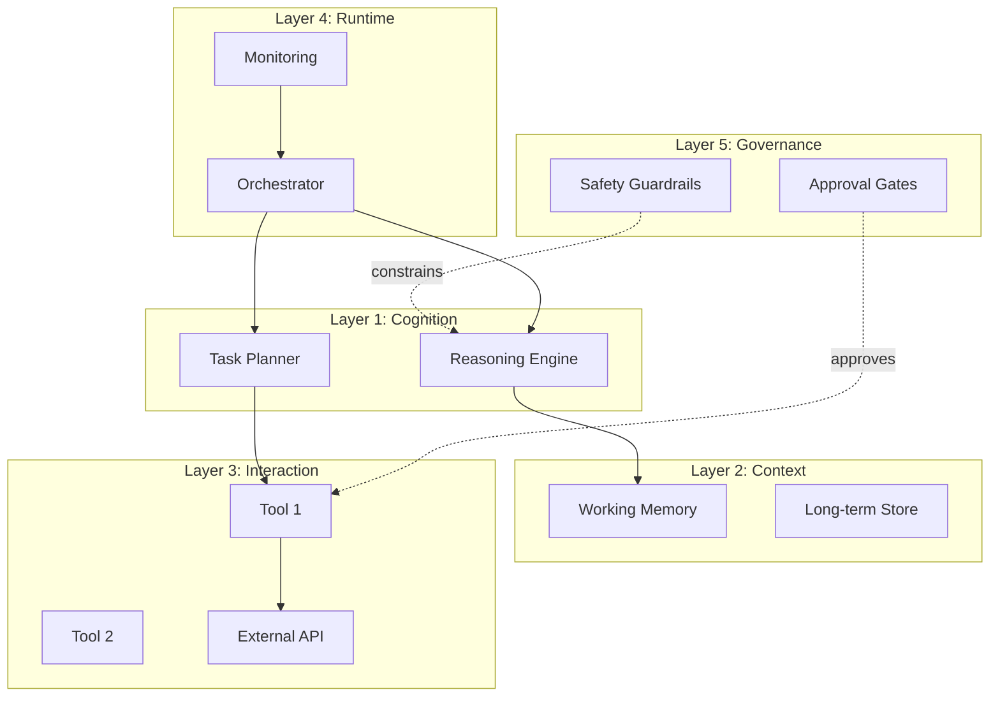
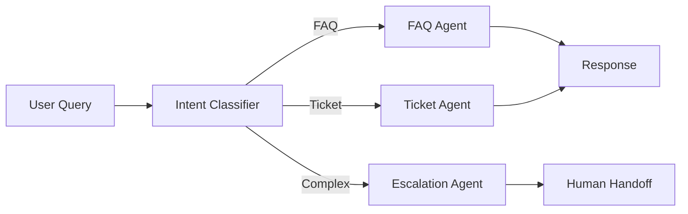

# /wicked-garden:agentic-design

Interactive design session for agentic architectures. Guides you through problem analysis, pattern selection, and architecture design with built-in safety validation.

## Instructions

### 1. Capture Problem Statement

If user provides problem description, use it. Otherwise, spawn architect to gather requirements.

### 2. Spawn Architect in Design Mode

```
Task(
  subagent_type="wicked-garden:agentic/architect",
  prompt="Mode: design\n\nInstructions:\nYou are helping design a new agentic system. Ask clarifying questions to understand:\n\n1. Problem Space - What problem are you solving? Who are the users? What is the success criteria?\n2. Functional Requirements - What tasks must the system perform? What data sources and integrations are needed?\n3. Non-Functional Requirements - Latency? Cost constraints? Scale expectations? Compliance?\n4. Constraints - Existing tech stack? Team expertise? Timeline?\n\nAsk 3-5 focused questions. Keep questions concrete and answerable."
)
```

### 3. Load Design Skills

After gathering requirements:

```
Task(
  subagent_type="wicked-garden:agentic/architect",
  prompt="Context:\n- Problem: {problem_statement}\n- Requirements: {requirements_summary}\n\nInstructions:\nLoad skills:\n- wicked-garden:agentic-agentic-patterns\n- wicked-garden:agentic-five-layer-architecture\n\nBased on requirements, recommend:\n1. Appropriate agentic pattern (sequential, hierarchical, parallel, etc.)\n2. Five-layer architecture design\n3. Framework selection (if applicable)\n4. Agent decomposition strategy"
)
```

### 4. Generate Architecture Recommendation

Architect produces:

```markdown
## Recommended Architecture

### Pattern: {selected_pattern}

**Rationale**: {why this pattern fits}

**Trade-offs**:
- Pros: {benefits}
- Cons: {limitations}

### Five-Layer Design



### Agent Breakdown

| Agent | Responsibility | Tools | Inputs | Outputs |
|-------|---------------|-------|--------|---------|
| {name} | {role} | {tools} | {inputs} | {outputs} |

### Control Flow

1. {step-by-step flow}

### State Management

- **Approach**: {stateful/stateless}
- **Storage**: {where state lives}
- **Persistence**: {how state is saved}

### Error Handling

- **Strategy**: {retry/fallback/fail-fast}
- **Monitoring**: {what to track}

### Framework Recommendation

**Suggested**: {framework}

**Reasoning**: {why}

**Alternatives**:
- {alternative}: {when to use instead}
```

### 5. Safety Validation

Spawn safety reviewer to validate design:

```
Task(
  subagent_type="wicked-garden:agentic/safety-reviewer",
  prompt="Context:\n- Proposed architecture: {architecture_summary}\n- Tools planned: {tool_list}\n- Data handled: {data_types}\n\nInstructions:\nLoad skill wicked-garden:agentic-trust-and-safety\n\nReview design for safety:\n1. Tool risk assessment\n2. Required human-in-the-loop gates\n3. PII handling strategy\n4. Input validation requirements\n5. Rate limiting needs\n6. Failure modes and mitigations\n\nOutput safety considerations:\n- Required safeguards\n- Compliance requirements\n- Risk mitigations\n- Testing recommendations"
)
```

Safety reviewer produces:

```markdown
## Safety Considerations

### Tool Risk Assessment
| Tool | Risk Level | Required Mitigations |
|------|------------|---------------------|
| {tool} | {HIGH/MEDIUM/LOW} | {mitigations} |

### Required Safeguards
1. **Human-in-the-loop**: {where required}
2. **Input validation**: {validation rules}
3. **Rate limiting**: {limits to impose}
4. **Audit logging**: {events to log}

### Compliance Requirements
- {requirement}: {how to address}

### Testing Recommendations
1. {test scenario for safety}

### Failure Modes
| Failure | Impact | Mitigation |
|---------|--------|-----------|
| {failure} | {impact} | {how to handle} |
```

### 6. Generate Design Document

Combine architecture recommendation and safety validation:

```markdown
# Agentic Architecture Design

**Problem**: {problem_statement}
**Pattern**: {selected_pattern}
**Framework**: {recommended_framework}
**Generated**: {timestamp}

## Problem Statement

{detailed problem description}

## Requirements

### Functional
- {requirement}

### Non-Functional
- Latency: {target}
- Cost: {constraint}
- Scale: {expected_volume}

## Architecture

### Pattern: {selected_pattern}

{pattern description and rationale}

### Five-Layer Design

{mermaid diagram}

#### Layer 1: Cognition
{reasoning and planning capabilities}

#### Layer 2: Context
{memory, state management, knowledge}

#### Layer 3: Interaction
{tools, APIs, communication channels}

#### Layer 4: Runtime
{execution, monitoring, orchestration}

#### Layer 5: Governance
{safety, compliance, approval gates}

### Control Flow

1. User input → Workflow engine
2. {subsequent steps}

### State Management

**Approach**: {approach}
**Implementation**: {how to implement}

### Error Handling

**Strategy**: {strategy}
**Fallbacks**: {fallback mechanisms}

## Safety & Security

### Tool Risk Assessment
{risk assessment table}

### Required Safeguards
1. {safeguard}

### Compliance
- {compliance requirement}

### Monitoring & Observability
- {what to monitor}

## Framework Selection

**Recommended**: {framework}

**Why**: {reasoning}

**Alternatives**: {when to consider alternatives}

## Implementation Roadmap

### Phase 1: Foundation (Week 1)
1. Set up framework
2. Implement layer 1 & 2
3. Build first agent

### Phase 2: Core Agents (Week 2-3)
1. Implement remaining agents
2. Build tool layer
3. Add integrations

### Phase 3: Safety & Polish (Week 4)
1. Add safeguards
2. Implement monitoring
3. Testing & validation

## Success Metrics

- {metric}: {target}

## Open Questions

1. {question requiring decision}

## Next Steps

1. {immediate next action}
2. {follow-up action}
```

### 7. Write Output File

If `--output` specified, write the complete design document to the specified file:

```
Write(
  file_path="{output_file_path}",
  content="{complete_design_document}"
)
```

Then confirm to the user:
```
Design document written to {output_file_path}
```

If `--output` is NOT specified, present the design document inline in the conversation.

## Examples

### Interactive Design Session

```
User: /wicked-garden:agentic-design

Claude: I'll help you design an agentic system. Let me ask a few questions to understand your needs.

**Problem Space**
1. What problem are you trying to solve with agents?
2. Who will use this system?

**Requirements**
3. What tasks must the system perform?
4. What's your target latency?
5. Do you have any compliance requirements (GDPR, HIPAA, etc.)?

User: I want to build a research assistant that can analyze academic papers, extract key findings, and generate summaries. Users are researchers. It needs to search papers, read PDFs, extract citations, and synthesize findings. Latency isn't critical - 30-60s is fine. No special compliance needs.

Claude: Great! Based on your requirements, I recommend:

## Recommended Architecture

### Pattern: Hierarchical Orchestration

**Rationale**: Your research assistant needs a coordinator agent to manage multiple specialized sub-agents (search, extraction, synthesis). Hierarchical pattern provides clear separation of concerns.

[Generates full architecture with mermaid diagram]

### Agent Breakdown
| Agent | Responsibility | Tools | Inputs | Outputs |
|-------|---------------|-------|--------|---------|
| Coordinator | Orchestrate research workflow | None | User query | Final summary |
| Search Agent | Find relevant papers | arxiv_search, semantic_scholar | Keywords | Paper list |
| Extraction Agent | Extract key info from PDFs | pdf_reader, citation_parser | PDF URLs | Structured data |
| Synthesis Agent | Generate summaries | None | Extracted data | Summary |

### Framework Recommendation

**Suggested**: LangGraph

**Reasoning**: LangGraph's stateful graph structure is perfect for research workflows with complex dependencies. Built-in state persistence and conditional routing.

[Safety validation follows...]

## Safety Considerations

### Tool Risk Assessment
| Tool | Risk Level | Required Mitigations |
|------|------------|---------------------|
| pdf_reader | LOW | Validate URLs, limit file size |
| arxiv_search | LOW | Rate limiting (10 req/min) |

### Required Safeguards
1. **Input validation**: Sanitize search queries, validate PDF URLs
2. **Rate limiting**: Respect API limits on external services
3. **Audit logging**: Log all searches and papers accessed

[Full design document generated...]
```

### Quick Design with Problem Statement

```
User: /wicked-garden:agentic-design "Build a customer support bot that can answer FAQs, create tickets, and escalate to humans when needed"

Claude: I'll design an architecture for your customer support bot.

[Architect asks 2-3 clarifying questions about scale, integrations, etc.]

User: Expected 1000 requests/day, integrate with Zendesk, need <2s response time

Claude:

# Agentic Architecture Design

**Problem**: Customer support automation with human escalation
**Pattern**: Sequential Chain with Conditional Branching
**Framework**: LangChain

## Architecture

### Pattern: Sequential Chain

Customer input flows through intent classification → handler selection → action execution. Simple, predictable, low-latency.



[Rest of design document...]

## Safety Considerations

### Required Safeguards
1. **Human-in-the-loop**: Escalate when confidence < 80%
2. **PII handling**: Redact PII before logging
3. **Rate limiting**: 100 req/min per user

[Full design document...]
```

### Save Design to File

```
User: /wicked-garden:agentic-design "Build a code review assistant" --output designs/code-review-agent.md

Claude: I'll design a code review assistant architecture.

[Interactive design session...]

Design document written to designs/code-review-agent.md

Key recommendations:
- Pattern: Parallel execution (multiple reviewers)
- Framework: CrewAI (built for collaborative agents)
- 4 specialized agents: style, security, performance, logic
- Estimated cost: $0.15 per review
```
