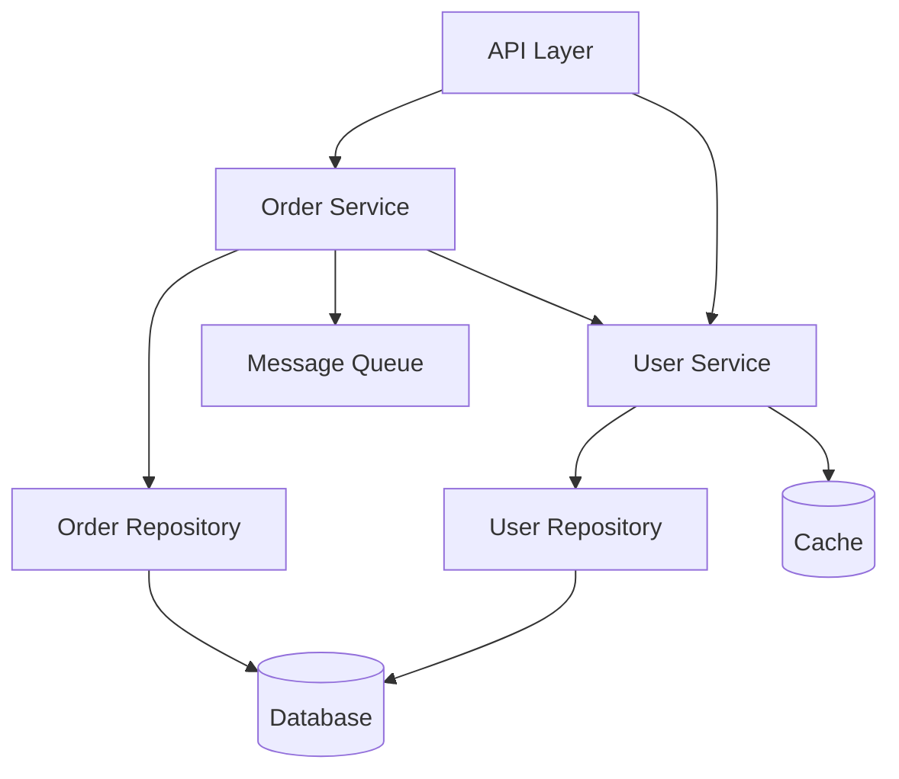

# Dependency Management Guide

Best practices for managing dependencies between components in a system.

## Dependency Principles

### 1. Acyclic Dependencies Principle

**Never create circular dependencies between components.**

```
Bad: A → B → C → A  (Circular)

Good: A → B → C     (Acyclic)
```

### 2. Stable Dependencies Principle

**Depend on components more stable than yourself.**

```
Unstable (changes frequently) → Stable (changes rarely)

UI → Services → Domain → Utilities
```

### 3. Dependency Inversion Principle

**Depend on abstractions, not concrete implementations.**

```typescript
// Bad: Depends on concrete class
class UserService {
  private db: PostgresDatabase;  // Concrete dependency

  constructor() {
    this.db = new PostgresDatabase();
  }
}

// Good: Depends on abstraction
interface Database {
  query(sql: string): Promise<any>;
}

class UserService {
  constructor(private db: Database) {}  // Abstract dependency
}
```

## Types of Dependencies

### Compile-Time Dependencies

Dependencies established at code level.

```typescript
import { UserRepository } from './repositories/UserRepository';

class UserService {
  constructor(private userRepo: UserRepository) {}
}
```

### Runtime Dependencies

Dependencies resolved at runtime.

```typescript
const userService = container.resolve('UserService');
```

### External Dependencies

Third-party libraries and services.

```json
{
  "dependencies": {
    "express": "^4.18.0",
    "pg": "^8.11.0",
    "redis": "^4.6.0"
  }
}
```

### Temporal Dependencies

Order of execution matters.

```typescript
// Database must be initialized before services
await database.connect();
const userService = new UserService(database);
```

## Dependency Visualization

### Dependency Diagram



### Component Layers

```
┌─────────────────────────┐
│      API Layer          │  No dependencies
├─────────────────────────┤
│   Application Layer     │  → Domain, Infrastructure
├─────────────────────────┤
│     Domain Layer        │  No dependencies
├─────────────────────────┤
│  Infrastructure Layer   │  → External services
└─────────────────────────┘

Dependencies flow downward only
```

## Managing Dependencies

### 1. Explicit Dependencies

Make dependencies explicit in constructor.

```typescript
// Bad: Hidden dependency
class OrderService {
  async createOrder(data: OrderData) {
    // Hidden dependency on global database
    await globalDB.insert('orders', data);
  }
}

// Good: Explicit dependency
class OrderService {
  constructor(
    private orderRepo: OrderRepository,
    private paymentService: PaymentService,
    private emailService: EmailService
  ) {}

  async createOrder(data: OrderData) {
    const order = await this.orderRepo.save(data);
    await this.paymentService.charge(order);
    await this.emailService.sendConfirmation(order);
    return order;
  }
}
```

### 2. Dependency Injection

Inject dependencies rather than creating them.

```typescript
// Bad: Creates own dependencies
class UserService {
  private db = new PostgresDatabase();
  private cache = new RedisCache();

  async getUser(id: string) {
    // ...
  }
}

// Good: Dependencies injected
class UserService {
  constructor(
    private db: Database,
    private cache: Cache
  ) {}

  async getUser(id: string) {
    const cached = await this.cache.get(`user:${id}`);
    if (cached) return cached;

    const user = await this.db.query('SELECT * FROM users WHERE id = $1', [id]);
    await this.cache.set(`user:${id}`, user);
    return user;
  }
}

// Wiring
const db = new PostgresDatabase(config.database);
const cache = new RedisCache(config.redis);
const userService = new UserService(db, cache);
```

### 3. Interface Segregation

Use small, focused interfaces.

```typescript
// Bad: Large interface
interface UserRepository {
  save(user: User): Promise<void>;
  findById(id: string): Promise<User>;
  findAll(): Promise<User[]>;
  search(query: string): Promise<User[]>;
  count(): Promise<number>;
  deleteOldUsers(): Promise<void>;
  exportToCSV(): Promise<string>;
}

// Good: Segregated interfaces
interface UserReader {
  findById(id: string): Promise<User>;
  findAll(): Promise<User[]>;
}

interface UserWriter {
  save(user: User): Promise<void>;
}

interface UserSearcher {
  search(query: string): Promise<User[]>;
}

// Service only depends on what it needs
class UserService {
  constructor(
    private userReader: UserReader,
    private userWriter: UserWriter
  ) {}
}
```

### 4. Dependency Abstraction

Abstract external dependencies.

```typescript
// External dependency abstraction
interface EmailGateway {
  send(to: string, subject: string, body: string): Promise<void>;
}

// Adapter for SendGrid
class SendGridAdapter implements EmailGateway {
  constructor(private apiKey: string) {}

  async send(to: string, subject: string, body: string): Promise<void> {
    await sendGrid.send({
      to,
      from: 'noreply@example.com',
      subject,
      html: body
    });
  }
}

// Adapter for AWS SES
class SESAdapter implements EmailGateway {
  async send(to: string, subject: string, body: string): Promise<void> {
    await ses.sendEmail({
      Destination: { ToAddresses: [to] },
      Message: {
        Subject: { Data: subject },
        Body: { Html: { Data: body } }
      },
      Source: 'noreply@example.com'
    });
  }
}

// Service depends on abstraction, not specific provider
class NotificationService {
  constructor(private emailGateway: EmailGateway) {}

  async sendWelcomeEmail(user: User): Promise<void> {
    await this.emailGateway.send(
      user.email,
      'Welcome!',
      `Hello ${user.name}`
    );
  }
}
```

## Dependency Tracking

### Dependency Matrix

Track dependencies between components.

| Component | Depends On |
|-----------|------------|
| UserController | UserService, AuthMiddleware |
| UserService | UserRepository, EmailService |
| OrderService | OrderRepository, UserService, PaymentService |
| PaymentService | PaymentGateway, OrderRepository |

### Dependency Metrics

```typescript
// Calculate coupling metrics
function calculateAfferentCoupling(component: string): number {
  // Number of components that depend on this component
  return dependencies.filter(d => d.dependsOn === component).length;
}

function calculateEfferentCoupling(component: string): number {
  // Number of components this component depends on
  return dependencies.filter(d => d.component === component).length;
}

function calculateInstability(component: string): number {
  const ce = calculateEfferentCoupling(component);
  const ca = calculateAfferentCoupling(component);
  // Instability = Ce / (Ce + Ca)
  // 0 = maximally stable, 1 = maximally unstable
  return ce / (ce + ca);
}
```

## Anti-Patterns

### 1. Circular Dependencies

```typescript
// Bad: Circular dependency
class UserService {
  constructor(private orderService: OrderService) {}
}

class OrderService {
  constructor(private userService: UserService) {}
}

// Fix: Extract common logic or use events
class UserService {
  constructor(private eventBus: EventBus) {}

  async createUser(data: UserData) {
    const user = await this.saveUser(data);
    this.eventBus.publish('user.created', { userId: user.id });
    return user;
  }
}

class OrderService {
  constructor(private eventBus: EventBus) {
    this.eventBus.subscribe('user.created', this.handleUserCreated);
  }

  private handleUserCreated = async (event: UserCreatedEvent) => {
    // Initialize order data for new user
  };
}
```

### 2. God Object

```typescript
// Bad: God object with many dependencies
class ApplicationService {
  constructor(
    private userRepo: UserRepository,
    private orderRepo: OrderRepository,
    private productRepo: ProductRepository,
    private paymentService: PaymentService,
    private emailService: EmailService,
    private smsService: SMSService,
    private notificationService: NotificationService,
    private analyticsService: AnalyticsService,
    private auditService: AuditService
  ) {}
}

// Fix: Split into focused services
class UserService {
  constructor(
    private userRepo: UserRepository,
    private emailService: EmailService
  ) {}
}

class OrderService {
  constructor(
    private orderRepo: OrderRepository,
    private paymentService: PaymentService,
    private notificationService: NotificationService
  ) {}
}
```

### 3. Hidden Dependencies

```typescript
// Bad: Hidden global dependency
class UserService {
  async getUser(id: string) {
    return await globalDatabase.query('SELECT * FROM users WHERE id = $1', [id]);
  }
}

// Fix: Explicit dependency
class UserService {
  constructor(private database: Database) {}

  async getUser(id: string) {
    return await this.database.query('SELECT * FROM users WHERE id = $1', [id]);
  }
}
```

### 4. Dependency on Unstable Components

```typescript
// Bad: Stable component depends on unstable component
class DomainEntity {
  constructor(private uiHelper: UIHelper) {}  // UI is unstable
}

// Fix: Invert dependency with abstraction
interface Formatter {
  format(value: any): string;
}

class DomainEntity {
  constructor(private formatter: Formatter) {}
}

// UI implements the interface
class UIFormatter implements Formatter {
  format(value: any): string {
    // UI-specific formatting
  }
}
```

### 5. Feature Envy

```typescript
// Bad: Component uses another's data extensively
class OrderService {
  async calculateTotal(order: Order): Promise<number> {
    let total = 0;
    for (const item of order.items) {
      const product = await this.productRepo.findById(item.productId);
      total += product.price * item.quantity;
    }
    return total;
  }
}

// Fix: Move logic to data owner
class Order {
  calculateTotal(productPrices: Map<string, number>): number {
    return this.items.reduce((total, item) => {
      const price = productPrices.get(item.productId) || 0;
      return total + (price * item.quantity);
    }, 0);
  }
}
```

## Dependency Resolution Strategies

### 1. Constructor Injection

```typescript
class UserService {
  constructor(
    private userRepo: UserRepository,
    private emailService: EmailService
  ) {}
}

// Wiring
const userService = new UserService(userRepo, emailService);
```

**Pros**: Dependencies explicit, immutable
**Cons**: Can lead to large constructors

### 2. Property Injection

```typescript
class UserService {
  userRepo: UserRepository;
  emailService: EmailService;
}

// Wiring
const userService = new UserService();
userService.userRepo = userRepo;
userService.emailService = emailService;
```

**Pros**: Optional dependencies
**Cons**: Mutable, less explicit

### 3. Method Injection

```typescript
class UserService {
  async createUser(data: UserData, emailService: EmailService) {
    const user = await this.saveUser(data);
    await emailService.sendWelcome(user);
    return user;
  }
}
```

**Pros**: Flexible, explicit per-call
**Cons**: Verbose, repetitive

### 4. Service Locator

```typescript
class ServiceLocator {
  private services = new Map();

  register<T>(name: string, instance: T): void {
    this.services.set(name, instance);
  }

  resolve<T>(name: string): T {
    return this.services.get(name);
  }
}

class UserService {
  async createUser(data: UserData) {
    const emailService = ServiceLocator.resolve<EmailService>('EmailService');
    await emailService.sendWelcome(data.email);
  }
}
```

**Pros**: Decoupled
**Cons**: Hidden dependencies, testing harder

## Best Practices

### 1. Minimize Dependencies

Each component should have as few dependencies as possible.

```typescript
// Bad: Many dependencies
class UserService {
  constructor(
    private dep1,
    private dep2,
    private dep3,
    private dep4,
    private dep5,
    private dep6
  ) {}
}

// Good: Fewer focused dependencies
class UserService {
  constructor(
    private userRepo: UserRepository,
    private eventBus: EventBus
  ) {}
}
```

### 2. Depend on Abstractions

```typescript
// Good: Depend on interface
interface Cache {
  get(key: string): Promise<any>;
  set(key: string, value: any): Promise<void>;
}

class UserService {
  constructor(private cache: Cache) {}
}

// Can swap implementations
const redisCache: Cache = new RedisCache();
const memoryCache: Cache = new MemoryCache();
```

### 3. Use Dependency Injection Container

```typescript
// Container setup
container.register('Database', () => new PostgresDatabase(config));
container.register('Cache', () => new RedisCache(config));
container.register('UserRepository', () => new UserRepository(
  container.resolve('Database')
));
container.register('UserService', () => new UserService(
  container.resolve('UserRepository'),
  container.resolve('Cache')
));

// Usage
const userService = container.resolve<UserService>('UserService');
```

### 4. Document Dependencies

```typescript
/**
 * UserService handles user management operations.
 *
 * Dependencies:
 * - UserRepository: Data access for users
 * - EmailService: Sends user notifications
 * - EventBus: Publishes domain events
 */
class UserService {
  constructor(
    private userRepo: UserRepository,
    private emailService: EmailService,
    private eventBus: EventBus
  ) {}
}
```

### 5. Test with Mocks

```typescript
describe('UserService', () => {
  it('should create user', async () => {
    // Mock dependencies
    const mockRepo: UserRepository = {
      save: jest.fn().mockResolvedValue({ id: '123' }),
      findById: jest.fn(),
      findByEmail: jest.fn()
    };

    const mockEmail: EmailService = {
      sendWelcome: jest.fn().mockResolvedValue(undefined)
    };

    // Test with mocks
    const service = new UserService(mockRepo, mockEmail);
    const user = await service.createUser({ email: 'test@example.com' });

    expect(mockRepo.save).toHaveBeenCalled();
    expect(mockEmail.sendWelcome).toHaveBeenCalledWith('test@example.com');
  });
});
```

### 6. Manage Temporal Dependencies

```typescript
// Lifecycle management
class Application {
  async start() {
    // Start in correct order
    await this.database.connect();
    await this.cache.connect();
    await this.messageQueue.connect();

    // Initialize services after infrastructure
    this.userService = new UserService(this.database, this.cache);
    this.orderService = new OrderService(this.database, this.messageQueue);

    // Start server last
    await this.server.listen(3000);
  }

  async stop() {
    // Stop in reverse order
    await this.server.close();

    await this.orderService.shutdown();
    await this.userService.shutdown();

    await this.messageQueue.disconnect();
    await this.cache.disconnect();
    await this.database.disconnect();
  }
}
```

### 7. Limit Dependency Depth

```typescript
// Bad: Deep dependency chain
A → B → C → D → E → F

// Good: Flatter structure
A → B
A → C
A → D
```

### 8. Package by Component

Organize code by component, not layer:

```
# Bad: Package by layer
src/
  controllers/
  services/
  repositories/

# Good: Package by component
src/
  users/
    user.controller.ts
    user.service.ts
    user.repository.ts
  orders/
    order.controller.ts
    order.service.ts
    order.repository.ts
```

### 9. Use Dependency Graphs

Visualize and analyze dependencies:

```bash
# Generate dependency graph
npx madge --image graph.png src/

# Find circular dependencies
npx madge --circular src/

# Check dependency violations
npx dependency-cruiser src/
```

### 10. Version External Dependencies

```json
{
  "dependencies": {
    "express": "4.18.2",      // Exact version
    "lodash": "^4.17.21",      // Compatible version
    "react": "~18.2.0"         // Patch updates only
  }
}
```

## Dependency Health Metrics

### Coupling

```typescript
// Low coupling (good)
class A {
  constructor(private b: InterfaceB) {}
}

// High coupling (bad)
class A {
  constructor(
    private b: B,
    private c: C,
    private d: D,
    private e: E,
    private f: F
  ) {}
}
```

### Cohesion

```typescript
// High cohesion (good) - related functionality together
class UserService {
  createUser() {}
  updateUser() {}
  deleteUser() {}
}

// Low cohesion (bad) - unrelated functionality
class UtilityService {
  createUser() {}
  sendEmail() {}
  calculateTax() {}
  generateReport() {}
}
```

### Stability

```
Stability = Efferent Coupling / (Efferent + Afferent Coupling)

0 = Most stable (many dependents, few dependencies)
1 = Most unstable (few dependents, many dependencies)
```
