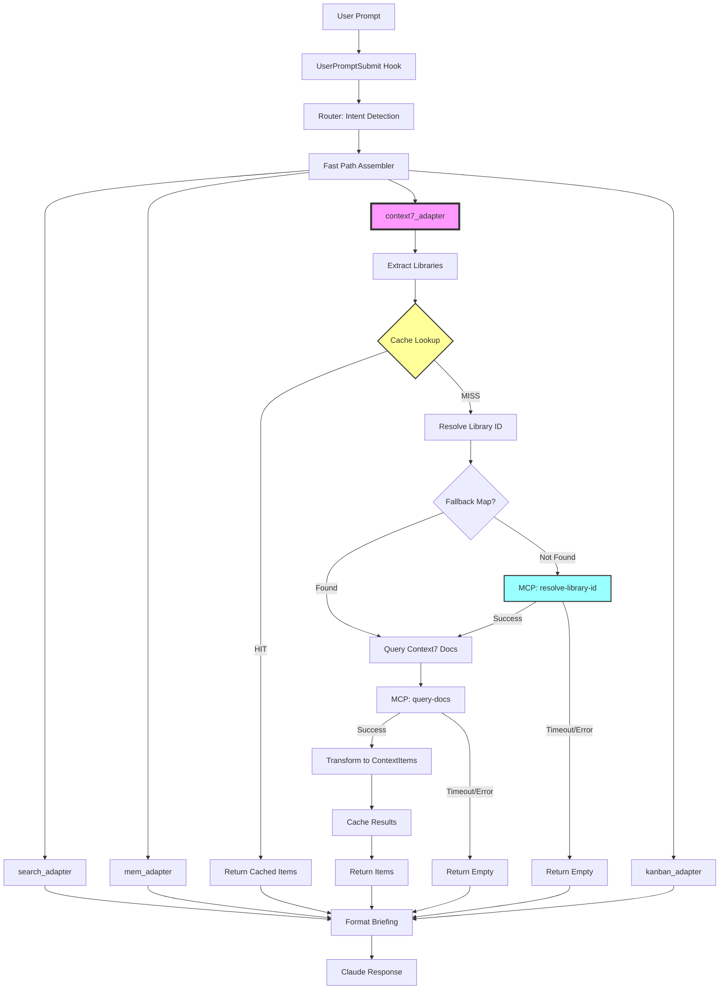

# Context7 Adapter Architecture

## System Overview



## Component Breakdown

### 1. Library Extraction

```
Input: "How to use React hooks for data fetching?"
        ↓
Patterns:
  - Direct mention: r'\b(react|vue|angular|...)\b'
  - Package mgr: r'npm install\s+(@?[\w-]+)'
  - Imports: r'from\s+([\w-]+)\s+import'
        ↓
Filter:
  - Remove built-ins (os, sys, json)
  - Deduplicate
  - Limit to 5
        ↓
Output: ["react"]
```

### 2. Cache Architecture

```
~/.something-wicked/wicked-smaht/cache/context7/
├── index.json              # Metadata index
│   {
│     "a1b2c3d4": {
│       "library_id": "/facebook/react",
│       "query": "use React hooks",
│       "cached_at": "2025-01-15T10:30:00Z",
│       "item_count": 5
│     }
│   }
└── data/
    └── a1b2c3d4.json       # Actual ContextItems
        [
          {
            "id": "context7:/facebook/react:0",
            "source": "context7",
            "title": "React: useEffect Hook",
            "summary": "...",
            "excerpt": "...",
            "relevance": 0.85,
            "metadata": {...}
          }
        ]
```

**Cache Key Generation**:
```python
def _cache_key(library_id: str, query: str) -> str:
    content = f"{library_id}:{query}"
    return hashlib.sha256(content.encode()).hexdigest()[:16]
```

**Cache Validation**:
```python
def _is_valid(entry: Dict) -> bool:
    cached_at = datetime.fromisoformat(entry['cached_at'])
    age_seconds = (datetime.now(timezone.utc) - cached_at).total_seconds()
    return age_seconds < CACHE_TTL_SECONDS  # 3600 seconds
```

### 3. Library ID Resolution

```
Input: "react"
        ↓
Normalize: "react" → "react" (lowercase, strip .js)
        ↓
Fallback Map:
  {
    'react': '/facebook/react',
    'nextjs': '/vercel/next.js',
    'fastapi': '/tiangolo/fastapi',
    ...
  }
        ↓
Found? → Return ID
        ↓
Not Found? → Try MCP: resolve-library-id
        ↓
MCP Success? → Return ID
        ↓
MCP Fail? → Return None
```

### 4. Documentation Query

```
Input: library_id="/facebook/react", query="use hooks"
        ↓
MCP Call: query-docs
  {
    "libraryId": "/facebook/react",
    "query": "use hooks"
  }
        ↓
Response: [
  {
    "title": "useEffect Hook",
    "content": "The useEffect Hook lets you...",
    "url": "https://react.dev/...",
    "score": 0.85
  },
  ...
]
        ↓
Transform to ContextItem:
  ContextItem(
    id="context7:/facebook/react:0",
    source="context7",
    title="React: useEffect Hook",
    summary="The useEffect Hook lets you..."[:200],
    excerpt="The useEffect Hook lets you..."[:500],
    relevance=0.85,
    metadata={
      'library_id': '/facebook/react',
      'url': 'https://react.dev/...',
      ...
    }
  )
```

### 5. Error Handling Flow

```
Try:
  items = await _query_context7(lib, query)
Except asyncio.TimeoutError:
  print(f"Warning: timeout for {lib}", stderr)
  continue  # Try next library
Except Exception as e:
  print(f"Warning: failed: {e}", stderr)
  continue  # Try next library
        ↓
Result: Partial results or empty list
        ↓
Fast path continues with other adapters
        ↓
Briefing includes all available sources
```

## Data Flow Example

### Example: "How to use React hooks?"

```
1. User Prompt
   "How to use React hooks for data fetching?"

2. Router Analysis
   Intent: IMPLEMENTATION
   Confidence: 0.75
   Entities: ["hooks", "React"]

3. Fast Path Adapter Selection
   ADAPTER_RULES[IMPLEMENTATION] = ["search", "kanban", "context7"]

4. Parallel Queries
   ├─ search: Query local codebase
   ├─ kanban: Check active tasks
   └─ context7:
      ├─ Extract: ["react"]
      ├─ Cache lookup: MISS
      ├─ Resolve ID: "react" → "/facebook/react" (fallback map)
      ├─ Query docs: MCP call
      ├─ Receive: 5 doc snippets
      ├─ Transform: 5 ContextItems
      └─ Cache: Save for 1 hour

5. Results
   search: 3 items (local code)
   kanban: 2 items (tasks)
   context7: 5 items (external docs)

6. Briefing
   ## Relevant Context

   ### Code & Docs
   - useDataFetch.ts: Custom hook implementation
   - FetchExample.tsx: Usage example

   ### Tasks
   - Task #42: Refactor data fetching hooks

   ### External Docs
   - React: useEffect Hook
   - React: Data Fetching
   - React: Custom Hooks

7. Claude Response
   Combines local patterns + official docs + task context
```

## Performance Characteristics

### Latency Budget

```
Fast Path Target: <500ms total

context7_adapter budget: ~100ms average
  - Cache hit: 5-10ms
  - Cache miss: 300-400ms
    - Extract libraries: 1ms
    - Resolve ID: 100ms (or 0ms if fallback)
    - Query docs: 200ms
    - Transform: 1ms
    - Cache write: 5ms
  - Timeout: 5000ms (hard limit, then skip)
```

### Caching Strategy

```
Cache Key: hash(library_id + full_query)

Pros:
  - High precision (exact query match)
  - No false positives

Cons:
  - Low hit rate for paraphrased queries
  - No semantic similarity

Trade-off Decision:
  ✓ Precision over recall
  ✓ Avoid irrelevant results
  ✓ Fast when it hits

Future Enhancement:
  - Semantic cache keys with embeddings
  - Fuzzy matching with similarity threshold
```

### Parallel Execution

```
Libraries: ["react", "vue", "angular"]
        ↓
Parallel queries (asyncio.gather):
  ├─ query_context7("react", prompt)    ─┐
  ├─ query_context7("vue", prompt)      ├─ 300ms (parallel)
  └─ query_context7("angular", prompt)  ─┘
        ↓
Total: ~300ms (not 900ms)
```

## Integration Points

### Router Integration

```python
# router.py
ADAPTER_RULES = {
    IntentType.IMPLEMENTATION: ["search", "kanban", "context7"],
    IntentType.RESEARCH: ["search", "mem", "context7"],
    ...
}
```

**Logic**: Include context7 for intents where external docs add value.

### Fast Path Integration

```python
# fast_path.py
class FastPathAssembler:
    def _load_adapters(self):
        adapters["context7"] = context7_adapter

    async def assemble(self, prompt, analysis):
        # Parallel query all adapters
        tasks = [self._query_adapter(name, prompt)
                 for name in adapter_names]
        results = await asyncio.gather(*tasks)
```

### MCP Integration

```python
# Via wicked-startah plugin
MCP Tools:
  1. mcp__plugin_wicked-startah_context7__resolve-library-id
     - Input: library_name, query
     - Output: library_id (e.g., "/facebook/react")

  2. mcp__plugin_wicked-startah_context7__query-docs
     - Input: library_id, query
     - Output: [doc_snippets]
```

**Fallback**: If MCP unavailable, use hardcoded library map.

## Testing Strategy

### Unit Tests

1. **Library Extraction**
   - Test all pattern types
   - Test false positive filtering
   - Test edge cases (empty, malformed)

2. **Cache Operations**
   - Test set/get cycle
   - Test TTL expiration
   - Test LRU eviction
   - Test corruption recovery

3. **Error Handling**
   - Test timeout behavior
   - Test MCP unavailable
   - Test malformed responses

### Integration Tests

1. **End-to-end with Mock MCP**
   - Mock resolve-library-id
   - Mock query-docs
   - Verify ContextItem transformation

2. **Cache Persistence**
   - Write cache to disk
   - Create new cache instance
   - Verify data persists

### Performance Tests

1. **Latency Benchmarks**
   - Measure cache hit latency
   - Measure cache miss latency
   - Measure timeout handling

2. **Cache Efficiency**
   - Track hit rate over session
   - Measure disk usage
   - Test eviction behavior

## Security Considerations

### Data Privacy

- **No code sent**: Only library names and query text
- **Local cache**: All data stored on user's machine
- **No telemetry**: No usage tracking
- **MCP only**: External calls only via MCP (controlled)

### Input Validation

- **Library name sanitization**: Remove special chars before query
- **Query length limits**: Prevent DoS via large queries
- **Cache size limits**: Max 500 entries, auto-eviction

### Error Disclosure

- **Minimal error info**: Don't leak system paths in errors
- **Stderr logging**: Warnings to stderr, not in briefing
- **Graceful degradation**: Never expose internal failures to user

## Monitoring & Observability

### Logging

```python
# Warning on timeout
print(f"Warning: Context7 query timeout for {lib_name}", file=sys.stderr)

# Warning on error
print(f"Warning: Context7 query failed for {lib_name}: {e}", file=sys.stderr)
```

### Metrics (Future)

- Cache hit rate
- Average latency by scenario
- Timeout rate
- Library detection accuracy
- User satisfaction (qualitative)

### Debugging

- Cache contents: `~/.something-wicked/wicked-smaht/cache/context7/`
- Index inspection: `cat index.json | jq`
- Clear cache: `rm -rf cache/context7/`

## Deployment Checklist

- [x] Adapter implementation (context7_adapter.py)
- [x] Cache implementation (Context7Cache class)
- [x] Library extraction patterns
- [x] Graceful error handling
- [ ] Update __init__.py (import context7_adapter)
- [ ] Update router.py (ADAPTER_RULES)
- [ ] Update fast_path.py (load context7_adapter)
- [ ] Unit tests (test_context7_adapter.py)
- [ ] Integration tests
- [ ] Performance benchmarks
- [ ] Documentation (README update)
- [ ] Scenario documentation
- [ ] Manual testing with real MCP

## Future Enhancements Roadmap

### Phase 1: Current Implementation
- ✓ Basic library extraction
- ✓ File-based TTL cache
- ✓ Fallback library map
- ✓ Graceful degradation

### Phase 2: MCP Integration
- Connect to real Context7 MCP tools
- Real-time library ID resolution
- Live documentation queries
- Telemetry/logging

### Phase 3: Optimization
- Semantic cache keys (embedding similarity)
- Result re-ranking (relevance to prompt)
- Enhanced library detection (AST parsing)
- Performance tuning based on metrics

### Phase 4: Advanced Features
- Multi-version support (React 17 vs 18)
- Cross-library synthesis (comparison queries)
- Custom library definitions (private docs)
- Integration with wicked-crew workflows
