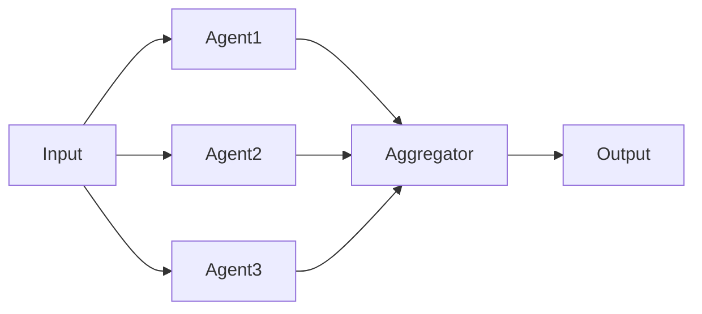

# Performance analysis — the report template

Loaded on demand by the `wicked-garden-agentic-performance-analyst` worker skill. Emit the template verbatim with the placeholders filled.

## Output Format

````markdown

## Performance Analysis: {Project Name}

**Analysis Date**: {date}
**Codebase Path**: {path}
**Performance Grade**: {A/B/C/D/F}

### Executive Summary

{2-3 sentence summary of performance posture and top opportunities}

### Performance Metrics

| Metric | Current | Target | Status |
|--------|---------|--------|--------|
| Avg Latency (p50) | {value}ms | {target}ms | {OK/NEEDS_IMPROVEMENT} |
| Avg Latency (p95) | {value}ms | {target}ms | {OK/NEEDS_IMPROVEMENT} |
| Avg Cost/Request | ${value} | ${target} | {OK/NEEDS_IMPROVEMENT} |
| Token Usage/Request | {value} | {target} | {OK/NEEDS_IMPROVEMENT} |
| Cache Hit Rate | {value}% | {target}% | {OK/NEEDS_IMPROVEMENT} |

### Token Analysis

**Total Token Usage**: {tokens}/request

**Breakdown**:
- System Prompt: {tokens} ({percent}%)
- User Input: {tokens} ({percent}%)
- Retrieved Context: {tokens} ({percent}%)
- Tool Results: {tokens} ({percent}%)
- Output: {tokens} ({percent}%)

**Findings**:
- **Issue**: {finding}
  - **Impact**: {description}
  - **Fix**: {recommendation}

**Optimization Opportunities**:
1. **Prompt Caching**: System prompt is {size} tokens, repeated every request
   - **Savings**: {percent}% on prompt tokens
   - **Implementation**: Enable prompt caching in API call
   - **Effort**: LOW

2. **Context Pruning**: Average {size} tokens of context, {percent}% unused
   - **Savings**: {percent}% on prompt tokens
   - **Implementation**: Implement importance-based pruning
   - **Effort**: MEDIUM

### Latency Analysis

**Latency Budget**: {target}s target, {value}s actual

**Breakdown**:
- Agent 1: {time}ms ({percent}%)
- Agent 2: {time}ms ({percent}%)
- Tool calls: {time}ms ({percent}%)
- RAG retrieval: {time}ms ({percent}%)
- LLM inference: {time}ms ({percent}%)

**Bottlenecks**:
1. **Sequential Agent Calls**: {location}
   - **Current**: {time}ms (sequential)
   - **Potential**: {time}ms (parallel)
   - **Speedup**: {improvement}x
   - **Implementation**: Use asyncio.gather()

2. **Expensive Tool Call**: {tool_name}
   - **Current**: {time}ms per call
   - **Optimization**: Cache results for {duration}
   - **Speedup**: {improvement}x on cache hit

**Parallelization Opportunities**:



**Recommendation**: {agents} can run in parallel, reducing latency from {sequential_time}ms to {parallel_time}ms ({improvement}x speedup)

### Cost Analysis

**Current Cost**: ${cost}/request

**Breakdown**:
- Prompt tokens: ${cost} ({percent}%)
- Completion tokens: ${cost} ({percent}%)
- Tool costs: ${cost} ({percent}%)

**Monthly Projection**:
- Requests/day: {count}
- Monthly cost: ${amount}

**Cost Optimization Opportunities**:

| Strategy | Savings/Request | Monthly Savings | Effort | Trade-off |
|----------|-----------------|-----------------|--------|-----------|
| Prompt caching | ${amount} ({percent}%) | ${amount} | LOW | None |
| Response caching | ${amount} ({percent}%) | ${amount} | MEDIUM | Freshness |
| Shorter prompts | ${amount} ({percent}%) | ${amount} | MEDIUM | Completeness |
| Model downgrade | ${amount} ({percent}%) | ${amount} | LOW | Quality |

**Top Recommendation**: {strategy}
- **Impact**: Save ${amount}/month ({percent}% reduction)
- **Effort**: {effort_level}
- **Risk**: {risk_level}
- **Implementation**: {steps}

### Caching Assessment

**Current Cache Usage**: {status}

**Cache Hit Rate**: {rate}% (target: 60%+)

**Caching Layers**:

| Layer | Status | Hit Rate | Savings | TTL |
|-------|--------|----------|---------|-----|
| Prompt Cache | {ENABLED/MISSING} | {rate}% | {amount} | {duration} |
| Response Cache | {ENABLED/MISSING} | {rate}% | {amount} | {duration} |
| Semantic Cache | {ENABLED/MISSING} | {rate}% | {amount} | {duration} |
| Tool Result Cache | {ENABLED/MISSING} | {rate}% | {amount} | {duration} |

**Findings**:
- **Missing**: Prompt caching not enabled
  - **Impact**: Wasting {percent}% on repeated system prompts
  - **Fix**: Enable prompt caching in API configuration
  - **Savings**: ${amount}/month

- **Low Hit Rate**: Response cache at {rate}%
  - **Impact**: Cache underutilized
  - **Fix**: Increase TTL from {current} to {recommended}
  - **Savings**: ${amount}/month

**Recommendations**:
1. Enable prompt caching for system prompts
2. Implement semantic caching for similar queries
3. Cache expensive tool results for {duration}

### Context Window Management

**Context Usage**: {tokens}/{max_tokens} ({percent}%)

**Strategy**: {SLIDING_WINDOW/IMPORTANCE_BASED/SUMMARIZATION/NONE}

**Findings**:
- **Issue**: No overflow strategy defined
  - **Risk**: Context overflow errors on long conversations
  - **Fix**: Implement sliding window with {size} token limit

- **Issue**: Old context not summarized
  - **Impact**: {percent}% of context is stale
  - **Fix**: Summarize messages older than {duration}

**Recommendations**:
1. Implement {strategy} for context management
2. Set hard limit at {percent}% of max context window
3. Prioritize: system prompt > recent messages > summaries

### Implementation Priorities

**Quick Wins** (Low effort, high impact):
1. {optimization} - {savings} for {effort}
2. {optimization} - {savings} for {effort}

**Medium-term** (Medium effort, medium-high impact):
1. {optimization} - {savings} for {effort}
2. {optimization} - {savings} for {effort}

**Long-term** (High effort, high impact):
1. {optimization} - {savings} for {effort}

### Next Steps

1. **Immediate**: {action}
2. **This Week**: {action}
3. **This Month**: {action}
4. **Ongoing**: Monitor performance metrics, iterate

### Cross-Skill Coordination

**Defer to**:
- **wicked-garden-agentic-architect**: For orchestration pattern changes
- **wicked-garden-agentic-safety-reviewer**: For validation efficiency
- **frameworks knowledge skill** (`skills/agentic/frameworks/`): For framework-native optimization features

**Collaborate with**:
- The architect skill on parallel execution patterns
- The safety-reviewer skill on efficient guardrails
````
