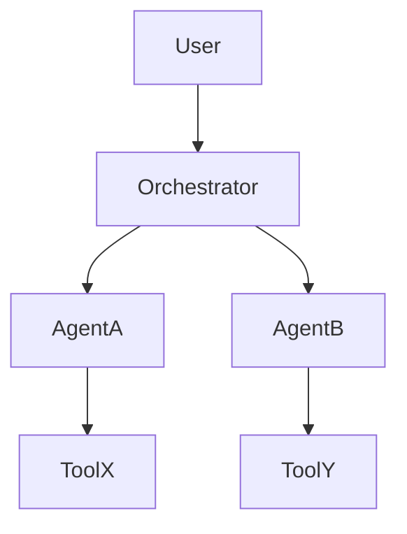

# agentic:design — Interactive Agentic Architecture Design Rubric

Full rubric sourced from `agents/agentic/architect.md` and
`skills/agentic/agentic-patterns/`. Use for greenfield agentic system design.

## Phase 1: Requirements Gathering

If no problem statement is supplied, ask 3–5 clarifying questions:

1. What is the primary task the agentic system must accomplish?
2. What tools / APIs / external systems must it interact with?
3. What are the concurrency and latency requirements?
4. What safety constraints apply (PII, HITL, compliance)?
5. What framework preferences or constraints exist?

## Phase 2: Pattern Selection

Pick from the agentic pattern catalog (`skills/agentic/agentic-patterns/refs/pattern-catalog.md`):

| Pattern | Use when |
|---------|---------|
| Scatter-Gather | Independent parallel lookups → aggregate |
| Pipeline | Sequential stages, each depending on prior |
| Router | Different input types → specialized agents |
| Retry with Fallback | Transient failures expected |
| Orchestrator / Subagents | Complex delegation with state |
| Event-Driven | Decoupled, reactive workflows |

## Phase 3: Five-Layer Architecture

Render a five-layer breakdown for the proposed system:

### Layer 1: Cognition
- Agent roles and single-responsibility assignments
- Reasoning pattern (ReAct, CoT, plan-and-execute)
- Task decomposition strategy
- Prompt versioning approach

### Layer 2: Context
- Memory scope (global vs. agent-local)
- State checkpointing strategy
- Context window budget (see `skills/agentic/context-engineering/`)
- Cleanup / archival policy

### Layer 3: Interaction
- Tool inventory with capability + risk classification
- External API contracts
- Multi-agent communication protocol
- Graceful degradation for tool failures

### Layer 4: Runtime
- Orchestration pattern (sequential | parallel | dynamic)
- Error handling and retry logic
- Resource quotas (max turns, max tokens, timeouts)
- Observability (structured logging, tracing, metrics)

### Layer 5: Governance
- Input / output validation points
- HITL gate placement (use Layer 3 tool risk to position)
- Audit logging requirements
- Compliance constraints

## Phase 4: Safety Section

Apply the 8-layer trust-and-safety checklist from `skills/agentic/refs/audit.md`
to the proposed architecture. For a design review, focus on:

- Tool risk classification (Layer 1 of audit)
- HITL gate placement (Layer 2 of audit)
- PII touchpoints (Layer 3 of audit)
- Prompt injection exposure (Layer 4 of audit)
- Failure mode defaults (Layer 8 of audit)

## Phase 5: Framework Recommendation

Using `skills/agentic/frameworks/SKILL.md` decision tree:

| Requirement | Recommended framework |
|-------------|----------------------|
| Complex state + loops | LangGraph |
| Role-based team | CrewAI or ADK |
| RAG-heavy | LlamaIndex Agents |
| TypeScript / Claude-only | Anthropic ADK |
| Type-safe Python | Pydantic AI |
| Multi-agent conversation | AutoGen |

## Output Format

```markdown
## Agentic Architecture Design: {System Name}

**Date**: {date} | **Pattern**: {chosen pattern} | **Framework**: {recommendation}

### Problem Statement

{refined from clarifying questions}

### Five-Layer Architecture

#### Layer 1: Cognition
{agent roster, roles, reasoning patterns}

#### Layer 2: Context
{memory strategy, state, checkpointing}

#### Layer 3: Interaction
{tool inventory with risk tier, API contracts}

#### Layer 4: Runtime
{orchestration, error handling, resource limits, observability}

#### Layer 5: Governance
{HITL gates, validation points, audit, compliance}

### Architecture Diagram



### Safety Validation

{8-layer safety checklist results — flag any CRITICAL/HIGH risks}

### Next Steps

1. {critical action}
2. {high action}
3. {medium action}

→ Use `agentic:review` to assess once code is written.
→ Use `agentic:audit` for compliance-grade evidence before production.
```
