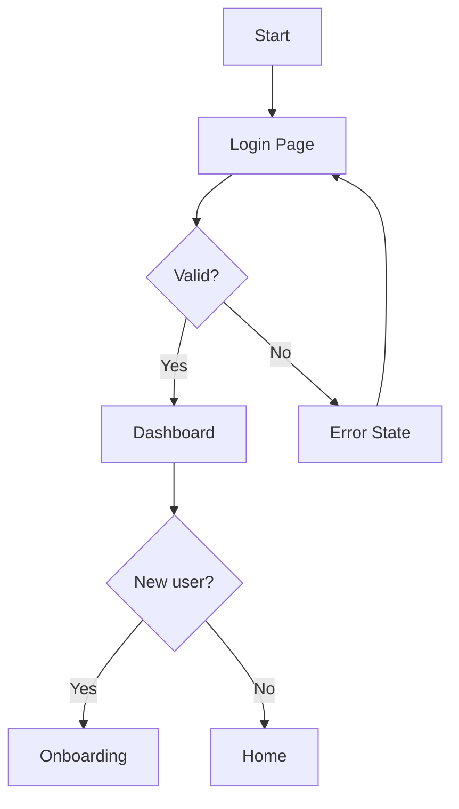

# UX Flow Skill

Design and map user flows, interaction patterns, and information architecture.
This skill is generative — it creates flows and IA structures from requirements
or existing code, rather than evaluating whether a flow is good.

## Core Concepts

### User Flow Types

| Type | Purpose | Output |
|------|---------|--------|
| Task flow | Single task, one path | Linear diagram |
| User flow | Multiple paths, decision points | Branching diagram |
| Screen flow | UI states per step | Annotated screens |
| System flow | Front-end + back-end | Swimlane diagram |

### Information Architecture Patterns

- **Hub and spoke**: Central home → feature areas → back
- **Sequential**: Step 1 → 2 → 3 (wizards, onboarding)
- **Hierarchical**: Category → subcategory → item
- **Matrix**: Tag-based, search-driven navigation
- **Flat**: All items at same level (single-page apps)

## Creating Flow Diagrams

### ASCII Notation (Quick Flows)

```
[Start] → [Login Page]
              ↓
         {Credentials valid?}
         /              \
        Yes              No
        ↓                ↓
   [Dashboard]     [Error Msg] → [Retry]
        ↓
   {Has onboarding?}
   /           \
  Yes           No
  ↓             ↓
[Setup Flow]  [Home]
```

### Mermaid (Rendered in Markdown)



## Flow Analysis Checklist

When analyzing an existing flow:

- [ ] Happy path is clear and short (minimize steps)
- [ ] Every decision point has all branches defined
- [ ] Error states have recovery paths (not dead ends)
- [ ] Back navigation is always available
- [ ] Confirmation shown after destructive actions
- [ ] Progress indicators on multi-step flows (3+ steps)
- [ ] Empty states handled (no data, no results)
- [ ] Loading states defined for async operations

## Information Architecture Mapping

From requirements or code, extract:

1. **Entry points**: How users arrive (direct URL, nav, link, email)
2. **Primary navigation**: Top-level sections
3. **Secondary navigation**: Sub-sections per primary area
4. **Content types**: What exists at each node
5. **Cross-links**: Non-hierarchical connections

### IA Map Format

```
App Root
├── Auth
│   ├── Login
│   ├── Register
│   └── Password Reset
├── Dashboard (requires auth)
│   ├── Overview
│   └── Widgets
└── Settings (requires auth)
    ├── Profile
    ├── Notifications
    └── Security
```

## Interaction Pattern Library

Common patterns and when to use them:

| Pattern | Use Case |
|---------|----------|
| Modal dialog | Focused action, doesn't lose context |
| Slide-over panel | Editing without navigation |
| Inline edit | Simple field edits |
| Full-page form | Complex data entry |
| Wizard | Multi-step, sequential |
| Accordion | Progressive disclosure |
| Tab set | Peer-level content switching |

## Output Formats

```markdown
## UX Flow: {feature or page}

### Overview
{1–2 sentences: what the flow accomplishes}

### Information Architecture
{IA tree or description}

### User Flow
{ASCII or Mermaid diagram}

### Step-by-Step
1. User arrives at {entry point}
2. {action} → {system response}
3. {decision} → {branch A / branch B}
...

### Edge Cases
- **Empty state**: {what shows when no data}
- **Error state**: {what shows on failure, recovery path}
- **Loading state**: {feedback during async ops}

### Open Questions
- {question requiring product/stakeholder input}
```

## Integration

- **mockup skill**: Pair with wireframes for each flow step
- **accessibility skill**: Check keyboard navigation through flow
- **product/ux-review**: Flows created here get evaluated there
- **wicked-crew**: Feeds into design phase deliverables
