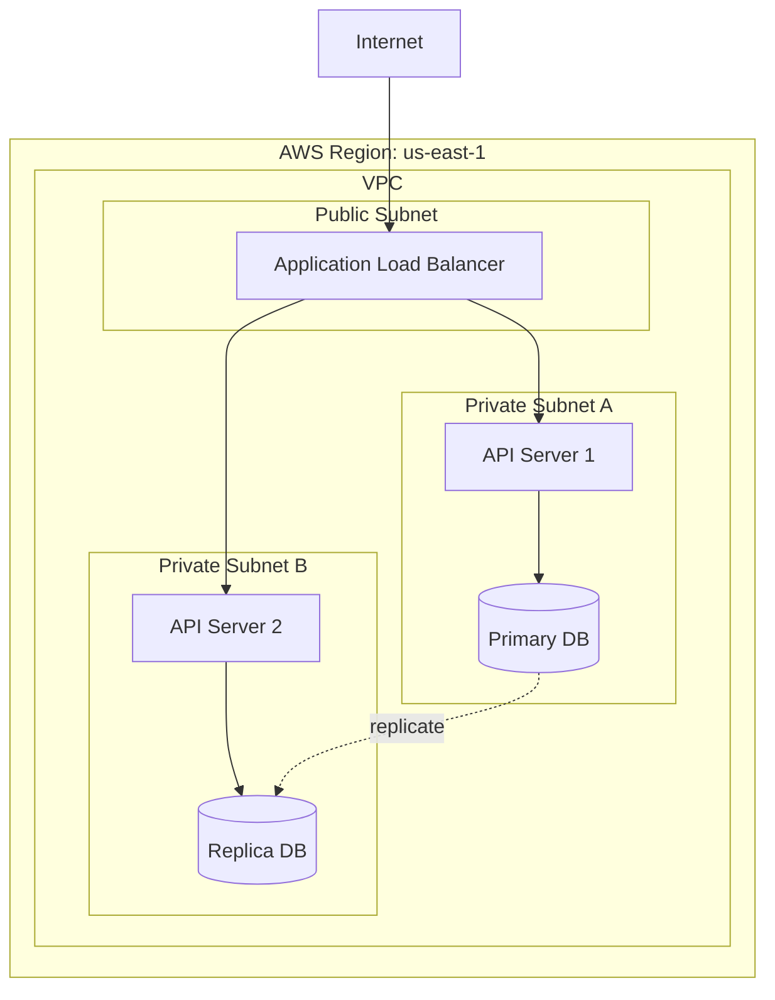
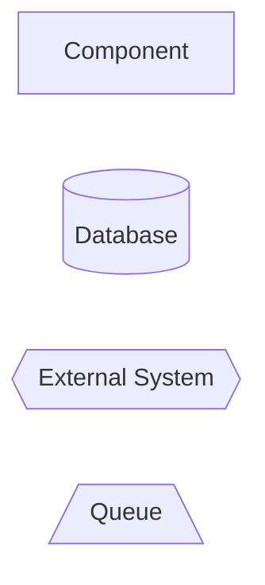

# Architecture Document Template: Deployment & Operations

Deployment architecture, release process, quality attributes, risks, future considerations, and template usage tips.

## Deployment

### Environment Strategy

| Environment | Purpose | Data | Deployment |
|-------------|---------|------|------------|
| Development | Feature work | Synthetic | On commit |
| Staging | Integration testing | Anonymized prod | Daily |
| Production | Live users | Real | On release tag |

### Deployment Architecture



### Release Process

1. Code merged to main
2. CI runs tests and builds
3. Deploy to staging automatically
4. Manual smoke tests
5. Approve production deployment
6. Blue-green deployment to prod
7. Health check validation
8. Monitor for 30 minutes

### Rollback

- Keep last 3 versions deployed
- Rollback via route change (< 2 min)
- Database migrations are forward-compatible

## Quality Attributes

### Non-Functional Requirements

| Attribute | Target | Measurement |
|-----------|--------|-------------|
| Performance | P95 < 200ms | APM tools |
| Availability | 99.9% | Uptime monitoring |
| Scalability | 10K req/min | Load testing |
| Security | Zero critical vulns | Security scans |
| Maintainability | <2 day bug fix | Issue tracking |
| Testability | >80% coverage | Coverage reports |

## Risks and Mitigations

| Risk | Impact | Probability | Mitigation |
|------|--------|-------------|------------|
| Database scaling limits | High | Medium | Plan for sharding, monitor growth |
| Third-party API downtime | Medium | Low | Circuit breaker, fallback cache |
| Team lacks Kubernetes experience | Medium | High | Use managed ECS instead |
| Cost overruns | High | Medium | Budget alerts, reserved instances |

## Future Considerations

### Known Limitations

- Single region deployment (no geographic distribution)
- Synchronous processing (could be async)
- Monolithic database (might need split)

### Evolution Path

**Phase 1** (Current): Monolithic API
**Phase 2** (6 months): Extract auth service
**Phase 3** (12 months): Event-driven architecture
**Phase 4** (18 months): Multi-region

### Technical Debt

- Legacy authentication code (plan to refactor Q3)
- Inconsistent error handling (standardize in v2)
- Missing API versioning (add before public launch)

## Appendices

### Glossary

- **API**: Application Programming Interface
- **JWT**: JSON Web Token
- **RTO**: Recovery Time Objective

### References

- [System Requirements](../requirements.md)
- [API Documentation](../api/openapi.yaml)
- [Infrastructure as Code](../../infrastructure/)
- [ADRs](decisions/)

### Diagram Legend



## Approval

| Role | Name | Date | Signature |
|------|------|------|-----------|
| Architect | [Name] | YYYY-MM-DD | |
| Tech Lead | [Name] | YYYY-MM-DD | |
| Engineering Manager | [Name] | YYYY-MM-DD | |
```

## Tips for Using This Template

### Don't Fill Everything

Only include sections relevant to your system:
- Small project: Focus on overview, components, tech stack
- Large project: Full template
- Microservice: Emphasize integration points

### Keep It Current

- Update as decisions change
- Mark outdated sections
- Link to newer ADRs
- Archive old versions

### Make It Scannable

- Use diagrams liberally
- Tables over prose
- Bullet points over paragraphs
- Clear headers

### Link, Don't Duplicate

- Reference ADRs for decisions
- Link to API specs
- Point to runbooks
- Connect to code

### Write for Your Audience

- Executives: Executive summary + risks
- Developers: Components + tech stack
- Operations: Deployment + monitoring
- Security: Security section + data flow
