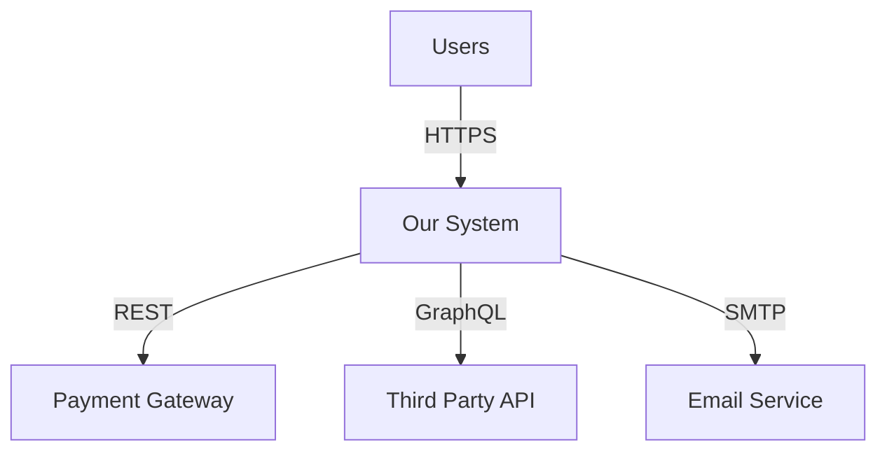
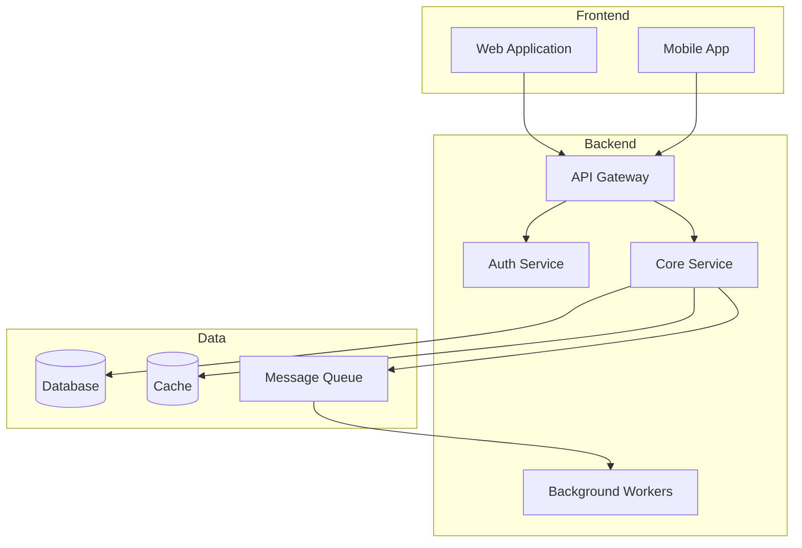
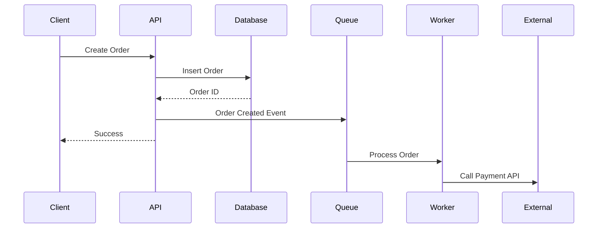

# Architecture Document Template: Design

Template for system overview, architecture style, components, data architecture, technology stack, and cross-cutting concerns.

## File Structure

```
phases/design/
├── architecture.md          # Main document (use this template)
├── decisions/               # ADRs
│   ├── 001-architecture-style.md
│   ├── 002-tech-stack.md
│   └── 003-data-storage.md
└── diagrams/
    ├── system-context.mmd
    ├── container-diagram.mmd
    └── deployment.mmd
```

## Main Document Template

```markdown
# [System Name] Architecture

**Version**: 1.0
**Date**: YYYY-MM-DD
**Status**: [Draft | Review | Approved]
**Architect**: [Name]

## Executive Summary

2-3 paragraph overview for non-technical stakeholders:
- What the system does
- Key architectural decisions
- Major components
- Technology choices

## System Overview

### Purpose

What problem does this system solve? Who are the users?

### Scope

What's in scope:
- Feature 1
- Feature 2
- Feature 3

What's out of scope:
- Explicitly excluded 1
- Future consideration 2

### Assumptions

- Assumption 1
- Assumption 2
- Assumption 3

### Constraints

- Technical constraints
- Business constraints
- Resource constraints
- Timeline constraints

## Architecture Style

### Selected Style

[Monolithic | Microservices | Serverless | Event-Driven | Layered | Hexagonal]

### Rationale

Why this style fits:
- Requirement alignment
- Team capabilities
- Scale needs
- Deployment model

See [ADR-001: Architecture Style](decisions/001-architecture-style.md)

## System Context

### External Systems



### Actors

| Actor | Role | Interactions |
|-------|------|--------------|
| End User | Primary user | Web/mobile interface |
| Admin | System operator | Admin dashboard |
| External System | Integration | API calls |

## Container View

High-level component architecture:



## Components

### Component 1: [Name]

**Purpose**: What it does

**Responsibilities**:
- Responsibility 1
- Responsibility 2
- Responsibility 3

**Technology**: [Language/Framework]

**Interfaces**:
- REST API on port 8080
- Publishes events to topic X
- Consumes events from topic Y

**Dependencies**:
- Database
- Cache
- External API

**Data**: What data it owns

**Scale**: Expected load and scaling approach

### Component 2: [Name]

[Same structure]

## Data Architecture

### Data Stores

| Store | Type | Purpose | Technology |
|-------|------|---------|------------|
| Primary DB | Relational | Transactional data | PostgreSQL 14 |
| Cache | Key-Value | Session, frequently accessed | Redis 7 |
| Search | Document | Full-text search | Elasticsearch 8 |
| Blob Storage | Object | Files, images | S3 |

See [ADR-003: Database Choice](decisions/003-database-choice.md)

### Data Flow



## Technology Stack

### Frontend

- **Framework**: React 18
- **State**: Redux Toolkit
- **Styling**: Tailwind CSS
- **Build**: Vite

### Backend

- **Runtime**: Node.js 20 LTS
- **Framework**: Express 4.x
- **Language**: TypeScript 5.x
- **Validation**: Zod

### Data

- **Database**: PostgreSQL 14
- **ORM**: Prisma 5.x
- **Cache**: Redis 7
- **Queue**: RabbitMQ 3.12

### Infrastructure

- **Hosting**: AWS
- **Containers**: Docker
- **Orchestration**: ECS
- **CI/CD**: GitHub Actions

See [ADR-002: Technology Stack](decisions/002-tech-stack.md)

## Cross-Cutting Concerns

### Security

**Authentication**:
- JWT tokens with 15-min expiry
- Refresh tokens with 7-day rotation
- OAuth2 for third-party

**Authorization**:
- Role-based access control (RBAC)
- Resource-level permissions
- API key for service-to-service

**Data Protection**:
- TLS 1.3 in transit
- AES-256 at rest
- PII encryption in database

### Observability

**Logging**:
- Structured JSON logs
- Log levels: ERROR, WARN, INFO, DEBUG
- Centralized in CloudWatch

**Metrics**:
- Request rates, latencies, errors
- Business metrics (orders, revenue)
- Dashboard in Grafana

**Tracing**:
- Distributed tracing with OpenTelemetry
- Trace sampling at 10%

### Error Handling

**Strategy**:
- Fail fast for unrecoverable errors
- Retry with exponential backoff
- Circuit breakers for external calls
- Graceful degradation where possible

**User Errors**: 4xx with helpful messages
**System Errors**: 5xx with correlation ID

### Performance

**Targets**:
- API P95 latency: <200ms
- Page load: <2s
- Database queries: <50ms

**Strategies**:
- Redis caching (5-min TTL)
- Database connection pooling (max 20)
- CDN for static assets
- Lazy loading for images

### Scalability

**Horizontal Scaling**:
- Stateless API servers (2-10 instances)
- Auto-scaling on CPU >70%
- Load balancer with round-robin

**Vertical Limits**:
- Database: t3.large (2 vCPU, 8GB)
- Cache: t3.medium (2 vCPU, 4GB)

**Expected Load**:
- 1000 concurrent users
- 10,000 requests/min
- 100GB data growth/year

### Reliability

**Targets**:
- Availability: 99.9% (43 min downtime/month)
- RTO: 4 hours
- RPO: 1 hour

**High Availability**:
- Multi-AZ deployment
- Database replication (primary + 1 read replica)
- Daily automated backups (30-day retention)

**Disaster Recovery**:
- Database snapshots every 6 hours
- Infrastructure as Code in Git
- Runbook for restore procedures
```
