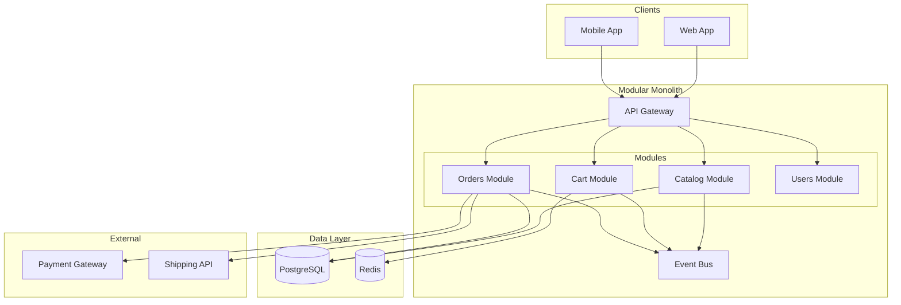
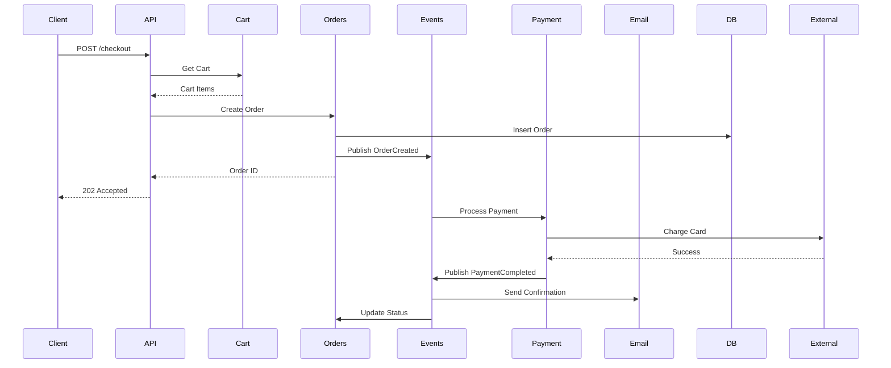
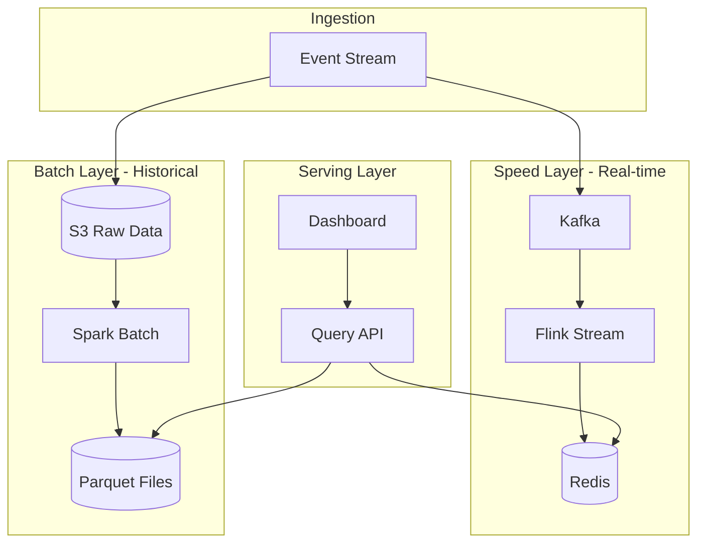

# Architecture Examples - E-Commerce and Analytics

Real-world architecture examples with complete ADRs and diagrams for e-commerce and analytics platforms.

## Example 1: E-Commerce Platform

### Context

Medium-sized online retail platform:
- 50,000 daily users
- 10,000 orders/day
- Integration with payment gateway, shipping
- Mobile + web clients
- Small team (5 developers)

### Architecture Decision

**Chosen**: Modular Monolith with Event-Driven components

**Rationale**:
- Team too small for microservices overhead
- Need quick iteration
- Event-driven for order processing
- Can extract services later

### ADR: Architecture Style

```markdown
# ADR-001: Modular Monolith Architecture

**Status**: Accepted
**Date**: 2025-01-15

## Context

We need to build an e-commerce platform that:
- Handles 50K daily users
- Processes 10K orders/day
- Integrates with external payment and shipping
- Supports web and mobile clients
- Can be built by a 5-person team

Initial launch in 3 months, with plans to scale 3x in first year.

## Decision

We will build a **modular monolith** with event-driven order processing.

Structure:
- Single deployable application
- Clear module boundaries (catalog, cart, orders, users)
- Event bus for async workflows (order processing)
- Shared database with schema-per-module

## Consequences

### Positive

- Faster development (no distributed system complexity)
- Easier debugging and testing
- Simple deployment pipeline
- Lower operational overhead
- Clear module boundaries allow future extraction

### Negative

- All modules deploy together
- Shared database limits independent scaling
- Risk of coupling if not disciplined
- Entire app restarts on deployment

### Mitigation

- Enforce module boundaries via package structure
- Use events for cross-module communication
- Plan extraction points for future microservices
- Monitor module dependencies

## Alternatives Considered

### Microservices

**Pros**: Independent scaling, deployment, technology choices
**Cons**: Operational complexity, distributed debugging, network overhead
**Rejected**: Team size and timeline don't support the overhead

### Traditional Monolith

**Pros**: Simplest approach, proven
**Cons**: No clear boundaries, harder to extract later
**Rejected**: Want clear module separation for future growth

## Migration Path

**Phase 1** (Months 0-6): Modular monolith
**Phase 2** (Months 6-12): Extract payment service (PCI compliance)
**Phase 3** (Months 12-18): Extract order service (independent scaling)

## Research

- [Shopify's Modular Monolith](https://example.com)
- Team survey: 3/5 have microservices experience but prefer starting simple
```

### Component Structure

```
src/
├── modules/
│   ├── catalog/
│   │   ├── domain/
│   │   │   ├── Product.ts
│   │   │   └── Category.ts
│   │   ├── application/
│   │   │   └── ProductService.ts
│   │   ├── infrastructure/
│   │   │   └── ProductRepository.ts
│   │   └── api/
│   │       └── ProductController.ts
│   │
│   ├── cart/
│   │   └── [same structure]
│   │
│   ├── orders/
│   │   └── [same structure]
│   │
│   └── users/
│       └── [same structure]
│
├── shared/
│   ├── events/
│   │   └── EventBus.ts
│   ├── database/
│   │   └── connection.ts
│   └── utils/
│
└── app.ts
```

### System Diagram



### Order Processing Flow



## Example 2: Real-Time Analytics Platform

### Context

Analytics SaaS for tracking user behavior:
- Ingests millions of events/day
- Real-time dashboards
- Historical reporting
- Multi-tenant

### Architecture Decision

**Chosen**: Lambda Architecture (Batch + Speed layers)

### ADR: Lambda Architecture

```markdown
# ADR-002: Lambda Architecture for Analytics

**Status**: Accepted
**Date**: 2025-01-20

## Context

Building analytics platform with:
- 10M events/day ingestion
- Real-time dashboards (<5s freshness)
- Historical reports (TB-scale data)
- Both need to query same logical data

Conflicting requirements:
- Real-time needs low latency
- Historical needs batch efficiency
- Both need accurate aggregations

## Decision

Implement **Lambda Architecture**:

**Speed Layer**: Real-time processing
- Kafka → Flink → Redis
- Recent data (last 24 hours)
- Approximate aggregations

**Batch Layer**: Historical processing
- S3 → Spark → Parquet
- All data (immutable)
- Accurate aggregations

**Serving Layer**: Unified queries
- Merge results from both layers
- API abstracts the complexity

## Consequences

### Positive

- Real-time and batch workloads optimized separately
- Immutable batch layer (replayable)
- Speed layer handles stragglers
- Scalable to billions of events

### Negative

- Two processing paths to maintain
- Eventual consistency between layers
- More operational complexity
- Duplicate logic risk

### Mitigation

- Share computation logic as libraries
- Automated reconciliation between layers
- Clear data freshness SLAs

## Alternatives Considered

### Pure Streaming (Kappa Architecture)

**Pros**: Single processing path
**Cons**: Hard to replay history, less efficient for large scans
**Rejected**: Historical queries are critical

### Pure Batch

**Pros**: Simpler, accurate
**Cons**: Can't meet real-time SLA
**Rejected**: Real-time is a key differentiator
```

### System Diagram


