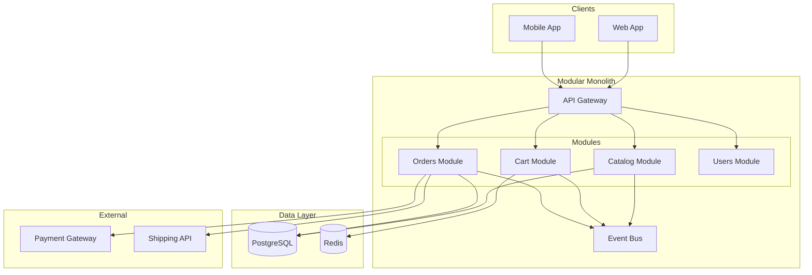
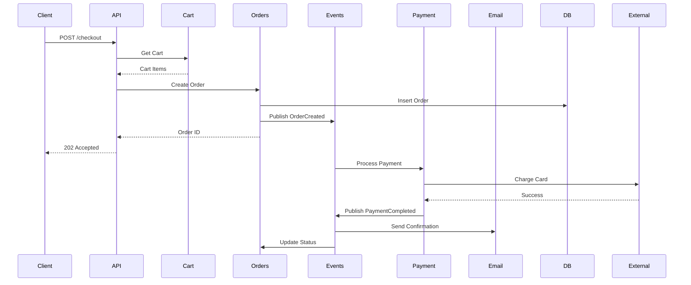
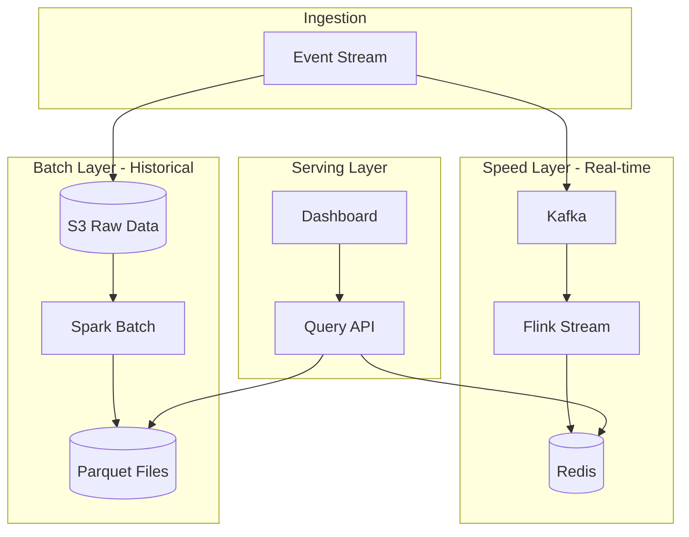

# Architecture Examples - E-Commerce and Analytics

Real-world architecture examples with complete ADRs and diagrams for e-commerce and analytics platforms.

## Example 1: E-Commerce Platform

### Context

Medium-sized online retail platform:
- 50,000 daily users
- 10,000 orders/day
- Integration with payment gateway, shipping
- Mobile + web clients
- Small team (5 developers)

### Architecture Decision

**Chosen**: Modular Monolith with Event-Driven components

**Rationale**:
- Team too small for microservices overhead
- Need quick iteration
- Event-driven for order processing
- Can extract services later

### ADR: Architecture Style

```markdown
# ADR-001: Modular Monolith Architecture

**Status**: Accepted
**Date**: 2025-01-15

## Context

We need to build an e-commerce platform that:
- Handles 50K daily users
- Processes 10K orders/day
- Integrates with external payment and shipping
- Supports web and mobile clients
- Can be built by a 5-person team

Initial launch in 3 months, with plans to scale 3x in first year.

## Decision

We will build a **modular monolith** with event-driven order processing.

Structure:
- Single deployable application
- Clear module boundaries (catalog, cart, orders, users)
- Event bus for async workflows (order processing)
- Shared database with schema-per-module

## Consequences

**Positive**: Faster development; easier debugging; simple deployment; lower ops overhead; clear module boundaries enable future extraction.
**Negative**: All modules deploy together; shared database limits independent scaling; risk of coupling if not disciplined.
**Mitigation**: Enforce boundaries via package structure; use events for cross-module communication.

## Alternatives Considered

**Microservices**: Independent scaling but operational complexity exceeds team capacity — rejected.
**Traditional Monolith**: Simplest but no clear boundaries, harder to extract later — rejected.

## Migration Path

**Phase 1** (Months 0-6): Modular monolith
**Phase 2** (Months 6-12): Extract payment service (PCI compliance)
**Phase 3** (Months 12-18): Extract order service (independent scaling)

## Research

- [Shopify's Modular Monolith](https://example.com)
- Team survey: 3/5 have microservices experience but prefer starting simple
```

### Component Structure

```
src/
├── modules/
│   ├── catalog/
│   │   ├── domain/
│   │   │   ├── Product.ts
│   │   │   └── Category.ts
│   │   ├── application/
│   │   │   └── ProductService.ts
│   │   ├── infrastructure/
│   │   │   └── ProductRepository.ts
│   │   └── api/
│   │       └── ProductController.ts
│   │
│   ├── cart/
│   │   └── [same structure]
│   │
│   ├── orders/
│   │   └── [same structure]
│   │
│   └── users/
│       └── [same structure]
│
├── shared/
│   ├── events/
│   │   └── EventBus.ts
│   ├── database/
│   │   └── connection.ts
│   └── utils/
│
└── app.ts
```

### System Diagram


```mermaid
graph TD
    subgraph "Clients"
        Web[Web App]
        Mobile[Mobile App]
    end

    subgraph "Modular Monolith"
        API[API Gateway]

        subgraph "Modules"
            Catalog[Catalog Module]
            Cart[Cart Module]
            Orders[Orders Module]
            Users[Users Module]
        end

        Events[Event Bus]

        Catalog --> Events
        Cart --> Events
        Orders --> Events
    end

    subgraph "Data Layer"
        DB[(PostgreSQL)]
        Cache[(Redis)]
    end

    subgraph "External"
        Payment[Payment Gateway]
        Shipping[Shipping API]
    end

    Web --> API
    Mobile --> API
    API --> Catalog
    API --> Cart
    API --> Orders
    API --> Users

    Catalog --> DB
    Cart --> Cache
    Orders --> DB
    Orders --> Payment
    Orders --> Shipping
```

### Order Processing Flow


```mermaid
sequenceDiagram
    participant C as Client
    participant API
    participant Cart
    participant Orders
    participant Events
    participant Payment
    participant Email

    C->>API: POST /checkout
    API->>Cart: Get Cart
    Cart-->>API: Cart Items
    API->>Orders: Create Order
    Orders->>DB: Insert Order
    Orders->>Events: Publish OrderCreated
    Orders-->>API: Order ID
    API-->>C: 202 Accepted

    Events->>Payment: Process Payment
    Payment->>External: Charge Card
    External-->>Payment: Success
    Payment->>Events: Publish PaymentCompleted

    Events->>Email: Send Confirmation
    Events->>Orders: Update Status
```

## Example 2: Real-Time Analytics Platform

### Context

Analytics SaaS for tracking user behavior:
- Ingests millions of events/day
- Real-time dashboards
- Historical reporting
- Multi-tenant

### Architecture Decision

**Chosen**: Lambda Architecture (Batch + Speed layers)

### ADR: Lambda Architecture

```markdown
# ADR-002: Lambda Architecture for Analytics

**Status**: Accepted
**Date**: 2025-01-20

## Context

Building analytics platform with:
- 10M events/day ingestion
- Real-time dashboards (<5s freshness)
- Historical reports (TB-scale data)
- Both need to query same logical data

Conflicting requirements:
- Real-time needs low latency
- Historical needs batch efficiency
- Both need accurate aggregations

## Decision

Implement **Lambda Architecture**:

**Speed Layer**: Real-time processing
- Kafka → Flink → Redis
- Recent data (last 24 hours)
- Approximate aggregations

**Batch Layer**: Historical processing
- S3 → Spark → Parquet
- All data (immutable)
- Accurate aggregations

**Serving Layer**: Unified queries
- Merge results from both layers
- API abstracts the complexity

## Consequences

**Positive**: Independent optimization of real-time and batch; immutable batch layer (replayable); scalable to billions of events.
**Negative**: Two processing paths; eventual consistency; duplicate logic risk.
**Mitigation**: Share logic as libraries; automated reconciliation; clear data freshness SLAs.

## Alternatives Considered

**Pure Streaming (Kappa)**: Single path, but hard to replay history — rejected, historical queries are critical.
**Pure Batch**: Simpler, accurate, but can't meet real-time SLA — rejected, real-time is a key differentiator.
```

### System Diagram


```mermaid
graph TD
    subgraph "Ingestion"
        Events[Event Stream]
    end

    subgraph "Speed Layer - Real-time"
        Kafka[Kafka]
        Flink[Flink Stream]
        Redis[(Redis)]
    end

    subgraph "Batch Layer - Historical"
        S3[(S3 Raw Data)]
        Spark[Spark Batch]
        Parquet[(Parquet Files)]
    end

    subgraph "Serving Layer"
        API[Query API]
        Dashboard[Dashboard]
    end

    Events --> Kafka
    Events --> S3

    Kafka --> Flink
    Flink --> Redis

    S3 --> Spark
    Spark --> Parquet

    API --> Redis
    API --> Parquet
    Dashboard --> API
```
