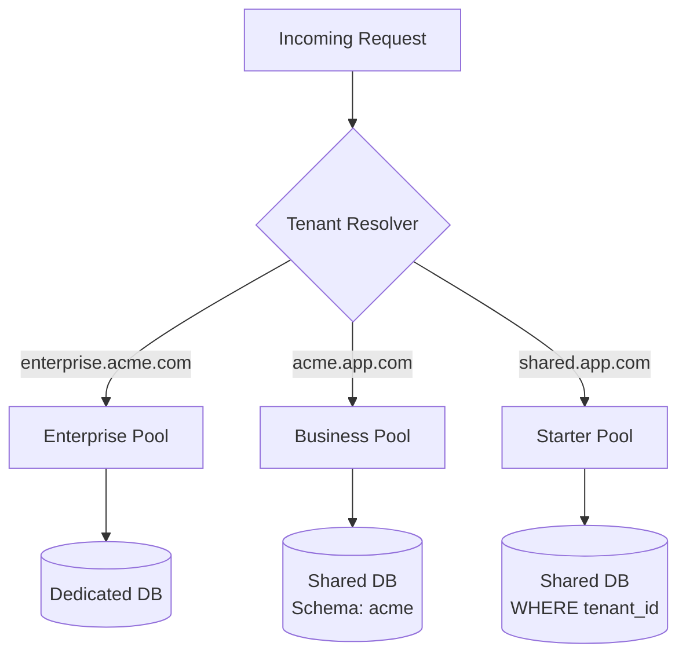
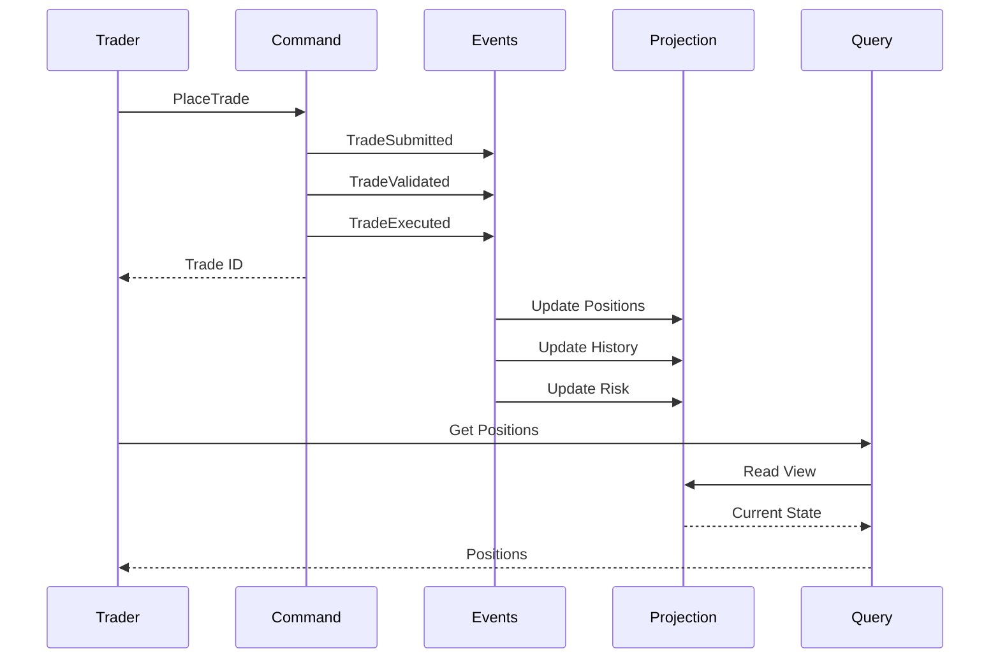

# Architecture Examples - SaaS and Trading

Real-world architecture examples with complete ADRs and diagrams for multi-tenant SaaS and financial trading platforms, plus pattern matching guide.

## Example 3: Multi-Tenant SaaS

### Context

B2B SaaS application:
- 1,000 customer tenants
- Varying sizes (10-10,000 users each)
- Data isolation required
- White-label capability

### Architecture Decision

**Chosen**: Hybrid tenancy model

```markdown
# ADR-003: Hybrid Multi-Tenancy Model

**Status**: Accepted
**Date**: 2025-01-22

## Context

Multi-tenant SaaS with diverse customer sizes:
- Tier 1: Enterprise (10 customers, 5K+ users each)
- Tier 2: Business (100 customers, 100-1K users)
- Tier 3: Starter (1K+ customers, 10-100 users)

Requirements:
- Data isolation (regulatory)
- Cost efficiency
- Performance isolation for large tenants
- White-label for enterprise

## Decision

**Hybrid tenancy model**:

**Tier 1 (Enterprise)**:
- Dedicated database per tenant
- Dedicated app instances
- Custom subdomain
- SLA: 99.9%

**Tier 2 (Business)**:
- Shared database, separate schemas
- Shared app pool
- Tenant subdomain
- SLA: 99.5%

**Tier 3 (Starter)**:
- Shared database, shared schema (tenant_id column)
- Shared app pool
- Shared domain
- SLA: 99%

## Consequences

### Positive

- Cost-effective for small tenants
- Performance isolation for large tenants
- Can customize enterprise deployments
- Clear upgrade path

### Negative

- More infrastructure variants
- Complex tenant routing
- Migration complexity on upgrades

## Implementation

**Tenant Resolver Middleware**:
```typescript
async function resolveTenant(req: Request): Promise<Tenant> {
  const hostname = req.hostname;

  // Enterprise: custom domain
  if (hostname.endsWith('.enterprise.com')) {
    return await enterpriseRepo.findByDomain(hostname);
  }

  // Business/Starter: subdomain
  const subdomain = hostname.split('.')[0];
  return await tenantRepo.findBySubdomain(subdomain);
}

async function connectDatabase(tenant: Tenant): Promise<Connection> {
  switch (tenant.tier) {
    case 'enterprise':
      return dedicatedPool.get(tenant.id);
    case 'business':
      return sharedPool.schema(tenant.schema);
    case 'starter':
      return sharedPool.where({ tenant_id: tenant.id });
  }
}
```
```

### Tenant Routing



## Example 4: Financial Trading Platform

### Context

Real-time trading platform:
- <50ms latency requirement
- High availability (99.99%)
- Regulatory compliance
- Complex event processing

### Architecture Decision

**Chosen**: CQRS + Event Sourcing

### ADR: Event Sourcing for Audit

```markdown
# ADR-004: Event Sourcing for Trade Audit Trail

**Status**: Accepted
**Date**: 2025-01-18

## Context

Regulatory requirements:
- Complete audit trail of all trades
- Point-in-time state reconstruction
- Immutable records
- 7-year retention

Performance requirements:
- <50ms trade execution
- High read throughput for positions
- Complex queries on trade history

## Decision

Implement **Event Sourcing** with **CQRS**:

**Write Side**:
- Store events in append-only log
- Events are source of truth
- Fast writes to event store

**Read Side**:
- Materialized views for queries
- Optimized for different use cases
- Eventually consistent

## Event Store

PostgreSQL with append-only table:
```sql
CREATE TABLE events (
  id SERIAL PRIMARY KEY,
  stream_id UUID NOT NULL,
  event_type VARCHAR(100) NOT NULL,
  event_data JSONB NOT NULL,
  metadata JSONB,
  version INTEGER NOT NULL,
  timestamp TIMESTAMPTZ NOT NULL DEFAULT NOW(),
  UNIQUE(stream_id, version)
);
```

## Read Models

Multiple projections:
- `current_positions`: Latest state
- `trade_history`: Queryable trades
- `risk_metrics`: Aggregated risk
- `compliance_view`: Regulatory reporting

## Consequences

### Positive

- Complete audit trail (regulatory requirement)
- Point-in-time reconstruction
- Optimized read models
- Natural event replay
- Temporal queries easy

### Negative

- Eventually consistent reads
- More storage (all events kept)
- Projection rebuilding complexity
- Schema evolution challenges

## Alternatives

### Traditional CRUD

**Rejected**: Can't reconstruct history, audit trail requires separate logging

### Change Data Capture

**Rejected**: Not all databases in stack support, harder to reason about
```

### Event Flow



## Pattern Matching Guide

| Example | Pattern | Why |
|---------|---------|-----|
| E-Commerce | Modular Monolith | Small team, known domain, future extraction |
| Analytics | Lambda Architecture | Real-time + historical, different optimization |
| SaaS | Hybrid Tenancy | Cost + isolation balance |
| Trading | Event Sourcing + CQRS | Audit + performance |

## Key Takeaways

1. **Start Simple**: E-commerce example chose monolith over microservices
2. **Match Requirements**: Analytics needed both real-time and batch
3. **Consider Trade-offs**: SaaS balanced cost vs isolation
4. **Regulatory Matters**: Trading chose event sourcing for compliance
5. **Team Size**: Architecture should match team capabilities
6. **Evolution Path**: All examples planned for future changes

## Common Mistakes

### Over-Engineering Early

Bad: "Let's use microservices for this 3-person startup"
Good: "Start with a modular monolith, extract later"

### Ignoring Non-Functional Requirements

Bad: Choosing CQRS because it's cool
Good: Choosing CQRS for audit/performance requirements

### No Evolution Plan

Bad: "This is the final architecture"
Good: "Phase 1: Monolith, Phase 2: Extract high-change services"

### Copying Without Understanding

Bad: "Netflix uses microservices, so should we"
Good: "Our requirements are X, so pattern Y fits"
