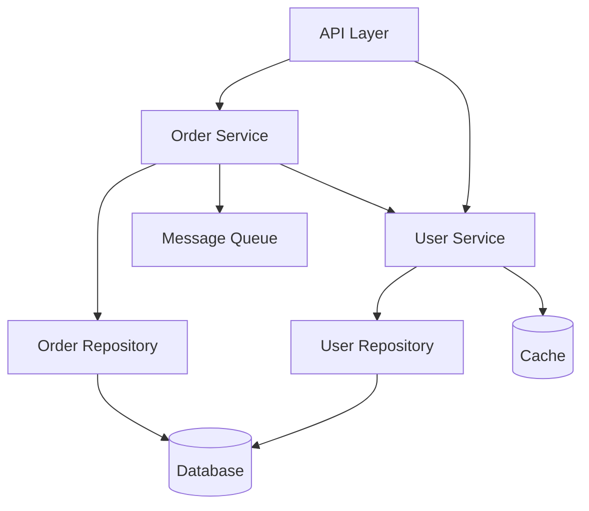

# Dependency Management Guide: Dependency Principles

## Dependency Principles

### 1. Acyclic Dependencies Principle

**Never create circular dependencies between components.**

```
Bad: A → B → C → A  (Circular)

Good: A → B → C     (Acyclic)
```

### 2. Stable Dependencies Principle

**Depend on components more stable than yourself.**

```
Unstable (changes frequently) → Stable (changes rarely)

UI → Services → Domain → Utilities
```

### 3. Dependency Inversion Principle

**Depend on abstractions, not concrete implementations.**

```typescript
// Bad: Depends on concrete class
class UserService {
  private db: PostgresDatabase;  // Concrete dependency

  constructor() {
    this.db = new PostgresDatabase();
  }
}

// Good: Depends on abstraction
interface Database {
  query(sql: string): Promise<any>;
}

class UserService {
  constructor(private db: Database) {}  // Abstract dependency
}
```

## Types of Dependencies

### Compile-Time Dependencies

Dependencies established at code level.

```typescript
import { UserRepository } from './repositories/UserRepository';

class UserService {
  constructor(private userRepo: UserRepository) {}
}
```

### Runtime Dependencies

Dependencies resolved at runtime.

```typescript
const userService = container.resolve('UserService');
```

### External Dependencies

Third-party libraries and services.

```json
{
  "dependencies": {
    "express": "^4.18.0",
    "pg": "^8.11.0",
    "redis": "^4.6.0"
  }
}
```

### Temporal Dependencies

Order of execution matters.

```typescript
// Database must be initialized before services
await database.connect();
const userService = new UserService(database);
```

## Dependency Visualization

### Dependency Diagram



### Component Layers

```
┌─────────────────────────┐
│      API Layer          │  No dependencies
├─────────────────────────┤
│   Application Layer     │  → Domain, Infrastructure
├─────────────────────────┤
│     Domain Layer        │  No dependencies
├─────────────────────────┤
│  Infrastructure Layer   │  → External services
└─────────────────────────┘

Dependencies flow downward only
```

## Managing Dependencies

### 1. Explicit Dependencies

Make dependencies explicit in constructor.

```typescript
// Bad: Hidden dependency
class OrderService {
  async createOrder(data: OrderData) {
    // Hidden dependency on global database
    await globalDB.insert('orders', data);
  }
}

// Good: Explicit dependency
class OrderService {
  constructor(
    private orderRepo: OrderRepository,
    private paymentService: PaymentService,
    private emailService: EmailService
  ) {}

  async createOrder(data: OrderData) {
    const order = await this.orderRepo.save(data);
    await this.paymentService.charge(order);
    await this.emailService.sendConfirmation(order);
    return order;
  }
}
```

### 2. Dependency Injection

Inject dependencies rather than creating them.

```typescript
// Bad: Creates own dependencies
class UserService {
  private db = new PostgresDatabase();
  private cache = new RedisCache();

  async getUser(id: string) {
    // ...
  }
}

// Good: Dependencies injected
class UserService {
  constructor(
    private db: Database,
    private cache: Cache
  ) {}

  async getUser(id: string) {
    const cached = await this.cache.get(`user:${id}`);
    if (cached) return cached;

    const user = await this.db.query('SELECT * FROM users WHERE id = $1', [id]);
    await this.cache.set(`user:${id}`, user);
    return user;
  }
}

// Wiring
const db = new PostgresDatabase(config.database);
const cache = new RedisCache(config.redis);
const userService = new UserService(db, cache);
```

### 3. Interface Segregation

Use small, focused interfaces.

```typescript
// Bad: Large interface
interface UserRepository {
  save(user: User): Promise<void>;
  findById(id: string): Promise<User>;
  findAll(): Promise<User[]>;
  search(query: string): Promise<User[]>;
  count(): Promise<number>;
  deleteOldUsers(): Promise<void>;
  exportToCSV(): Promise<string>;
}

// Good: Segregated interfaces
interface UserReader {
  findById(id: string): Promise<User>;
  findAll(): Promise<User[]>;
}

interface UserWriter {
  save(user: User): Promise<void>;
}

interface UserSearcher {
  search(query: string): Promise<User[]>;
}

// Service only depends on what it needs
class UserService {
  constructor(
    private userReader: UserReader,
    private userWriter: UserWriter
  ) {}
}
```

### 4. Dependency Abstraction

Abstract external dependencies.

```typescript
// External dependency abstraction
interface EmailGateway {
  send(to: string, subject: string, body: string): Promise<void>;
}

// Adapter for SendGrid
class SendGridAdapter implements EmailGateway {
  constructor(private apiKey: string) {}

  async send(to: string, subject: string, body: string): Promise<void> {
    await sendGrid.send({
      to,
      from: 'noreply@example.com',
      subject,
      html: body
    });
  }
}

// Adapter for AWS SES
class SESAdapter implements EmailGateway {
  async send(to: string, subject: string, body: string): Promise<void> {
    await ses.sendEmail({
      Destination: { ToAddresses: [to] },
      Message: {
        Subject: { Data: subject },
        Body: { Html: { Data: body } }
      },
      Source: 'noreply@example.com'
    });
  }
}

// Service depends on abstraction, not specific provider
class NotificationService {
  constructor(private emailGateway: EmailGateway) {}

  async sendWelcomeEmail(user: User): Promise<void> {
    await this.emailGateway.send(
      user.email,
      'Welcome!',
      `Hello ${user.name}`
    );
  }
}
```

